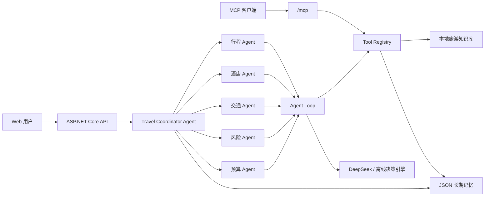

# 旅序：多 Agent 旅游规划系统

基于 `.NET 10`、ASP.NET Core 与 DeepSeek API 的课程期末项目。用户输入出发地、目的地、日期、天数、人数、预算与偏好后，系统由主控 Agent 协调五个专业 Agent，生成每日行程、住宿、交通、预算和风险提醒。

系统支持两种运行模式：

- **DeepSeek 在线模式**：配置 API Key 后，使用模型完成工具选择与多轮函数调用。
- **离线演示模式**：未配置 API Key 或 API 暂时失败时，使用确定性决策引擎执行同一套 Agent Loop 与工具，保证课堂演示稳定。

## 功能亮点

- 手写 `Thought → Action → Observation → Final Answer` ReAct 循环。
- 主控 Agent + 行程、酒店、交通、预算、风险 5 个专业 Agent。
- 9 个带 JSON Schema 的自定义工具。
- 当前会话工作记忆 + JSON 文件长期偏好记忆。
- 本地旅游知识库，覆盖日本东京/京都/大阪、杭州、成都和新加坡。
- DeepSeek HTTP 客户端、自动工具调用、错误降级与日志。
- DeepSeek 原生流式响应 + Web SSE 实时推送，生成期间以聊天形式展示 Agent 回复、工具调用和返回结果。
- 官方 MCP C# SDK + Streamable HTTP 服务，复用 9 个旅游工具。
- 联网旅游研究工具，按主题检索景点、美食、交通、签证、天气、灾害和治安，并保留来源链接。
- 预算超过用户预算 10% 时，自动触发行程、酒店、交通和预算 Agent 的第二轮规划。
- Web 端以聊天记录形式回放 Agent 执行轨迹，不展示或伪造模型私有思维链。
- 香港、台湾等目的地提供真实命名景点候选，禁止使用“城市博物馆”等虚构占位名称。
- xUnit 单元测试与响应式界面。

## 快速开始

### 环境要求

- [.NET SDK 10](https://dotnet.microsoft.com/)
- 可选：DeepSeek API Key

### 1. 还原与测试

```bash
dotnet restore
dotnet test
```

### 2. 运行

不配置 API Key 时会自动使用离线演示模式：

```bash
dotnet run --project DotNetAgentDev/DotNetAgentDev.csproj
```

终端会显示访问地址，通常为 `http://localhost:5000` 或 `https://localhost:5001`。

### 3. 启用 DeepSeek

推荐在仓库根目录创建 `.env`：

```dotenv
DEEPSEEK_API_KEY=sk-your-api-key
DeepSeek__Model=deepseek-v4-flash
```

程序启动时会自动查找仓库根目录或项目目录中的 `.env`。也可以使用系统环境变量，且系统环境变量的优先级高于 `.env`：

```bash
export DEEPSEEK_API_KEY="sk-your-api-key"
dotnet run --project DotNetAgentDev/DotNetAgentDev.csproj
```

模型、地址、超时与最大输出长度可在
`DotNetAgentDev/appsettings.json` 中修改。项目默认使用 `deepseek-v4-flash`。

> DeepSeek 官方文档：[首次 API 调用](https://api-docs.deepseek.com/)、
> [Tool Calls](https://api-docs.deepseek.com/guides/function_calling)、
> [Chat Completion API](https://api-docs.deepseek.com/api/create-chat-completion)。

## 使用方式

1. 打开首页，填写旅行需求，或点击“填入示例”。
2. 点击“启动 Agent 团队”。
3. 在加载界面实时查看模型增量、Agent 阶段、工具行动与进度。
4. 在方案总览、每日行程、预算交通、风险提醒、Agent 轨迹间切换。
5. 点击右上角“历史方案”，查看长期记忆保存的计划与偏好。

推荐演示输入：

```text
出发地：上海
目的地：日本
天数：7
人数：1
预算：12000
节奏：轻松
偏好：美食、城市漫步、人文、夜景
备注：不想太赶，希望酒店靠近公共交通，并留出自由活动时间
```

## 系统架构



详细设计见 [架构设计文档](docs/架构设计.md)。

## Agent 与工具

| Agent | 主要职责 | 工具 |
| --- | --- | --- |
| 主控 Agent | 拆解任务、并行调度、冲突处理、结果整合 | 调度专业 Agent |
| 行程规划 Agent | 候选点、区域排序、每日节奏 | `preference_memory`、`travel_web_research`、`attraction_search`、`route_sort` |
| 酒店 Agent | 住宿位置、价格与便利度 | `hotel_search` |
| 交通 Agent | 大交通、跨城、市内交通 | `travel_web_research`、`transport_estimate` |
| 风险 Agent | 天气、签证、安全、强度 | `travel_web_research`、`weather_lookup`、`risk_check` |
| 预算 Agent | 汇总费用、检查超支、提出优化 | `budget_calculator` |

## 关键目录

```text
DotNetAgentDev/
├── DotNetAgentDev/
│   ├── Agents/          # ReAct 循环、专业 Agent、主控 Agent
│   ├── Data/            # 本地旅游知识库
│   ├── Infrastructure/  # JSON 记忆与数据读取
│   ├── Llm/             # DeepSeek 与离线模型客户端
│   ├── Mcp/             # MCP 工具适配层
│   ├── Models/          # 领域模型和 API 契约
│   ├── Services/        # 应用服务
│   ├── Tools/           # 9 个自定义工具与注册表
│   └── wwwroot/         # Web 界面
├── DotNetAgentDev.Tests/
└── docs/
```

运行时计划保存在 `DotNetAgentDev/App_Data/`，该目录已加入 `.gitignore`，不会提交用户历史数据。

## 流式输出

前端默认调用 `POST /api/plans/stream`。该端点使用 `text/event-stream` 返回：

- `progress`：系统阶段和保存进度。
- `trace`：Thought、Action、Observation、Final Answer 摘要。
- `delta`：DeepSeek 文本增量。
- `completed`：包含最终完整 `TravelPlan`。
- `error`：流式执行错误。

原有 `POST /api/plans` 仍保留，用于不支持流式读取的客户端。

## MCP Server

项目使用官方 `ModelContextProtocol.AspNetCore 1.4.0`，在应用启动后通过
Streamable HTTP 暴露 MCP 端点：

```text
http://localhost:<运行端口>/mcp
```

支持 `initialize`、`tools/list` 和 `tools/call`。MCP Server 直接复用内部
`ToolRegistry`，可发现并调用以下 9 个工具：

```text
attraction_search    route_sort          hotel_search
transport_estimate   budget_calculator   weather_lookup
risk_check           preference_memory   travel_web_research
```

支持 Streamable HTTP 的客户端可使用类似配置，具体外层字段以客户端文档为准：

```json
{
  "mcpServers": {
    "travel-planner": {
      "type": "http",
      "url": "http://localhost:5187/mcp"
    }
  }
}
```

服务采用无状态模式，适合本项目只读查询工具；MCP 工具均标记为
`readOnly`、`idempotent`、非破坏性和封闭数据域。`/api/status` 会返回 MCP
是否启用、端点、传输类型和工具数量。

## 安全与数据说明

- API Key 只能通过环境变量或本地配置注入，不得提交到 Git。
- MCP 默认面向本机客户端，`AllowedHosts` 仅允许本地回环地址。
- 联网搜索摘要不是预订确认或官方实时结论，签证、灾害和交通班次必须打开来源复核。
- 本地旅游价格和季节天气为课程演示数据，不是实时结论。
- DeepSeek 不可用时自动降级，不会让整次规划直接失败。
- 所有输入先做边界校验；工具异常会转换为 Observation，由 Agent 继续处理。

## 课程交付文档

- [架构设计文档](docs/架构设计.md)
- [反思报告](docs/反思报告.md)
- [答辩与演示脚本](docs/答辩演示.md)
- [课程要求实现对照](docs/课程要求实现对照.md)

## 测试

```bash
dotnet test --collect:"XPlat Code Coverage"
```

测试覆盖预算边界、预算超限二次规划、每日费用明细、输入校验、离线 Agent
工具选择顺序、本地知识库查询、中文 JSON 持久化与迁移，以及 MCP 工具发现
和共享注册表调用。

## 已知边界

- 本地知识库不是实时 API，真实出行前需要二次核验。
- 在线模式输出受模型稳定性与账户额度影响，因此保留离线模式。
- 当前长期记忆为单机 JSON 文件，适合课程项目；生产环境应换成数据库并增加用户认证。
