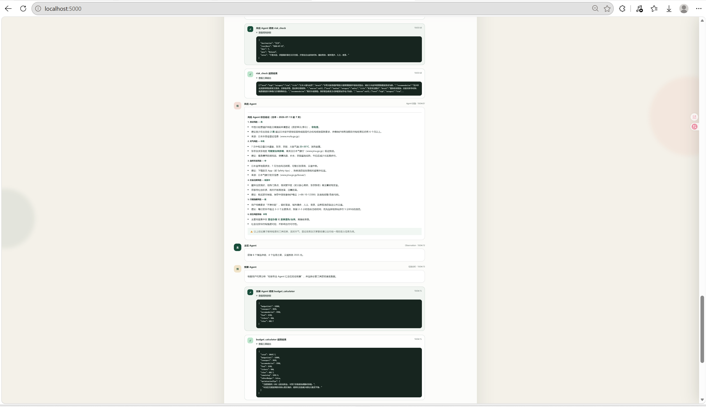
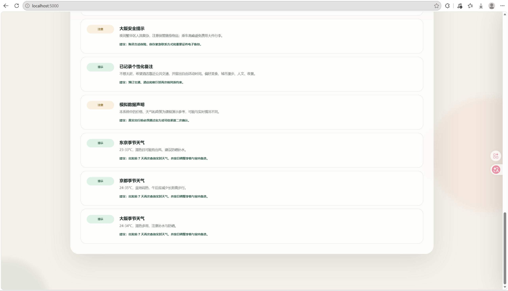
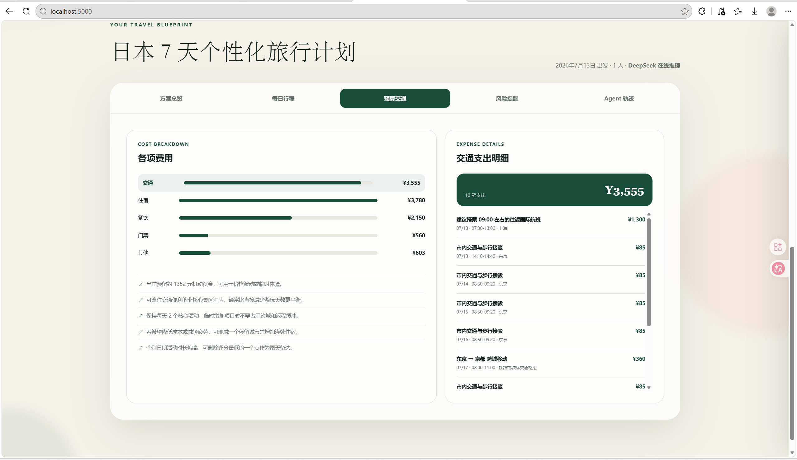
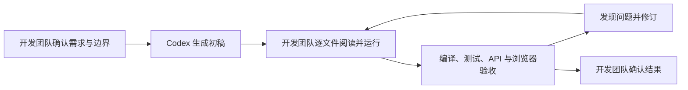

# 旅序：多 Agent 旅游规划系统 反思报告

项目成员：2351458 任泓臻 2352979 虞澍 2353117 黄彦炜 2354283黄迪

项目链接：https://github.com/traveler703/DotNetAgentDev

## 1. 项目背景与反思报告范围

### 1.1 项目目标与应用场景

本项目最终实现为 ASP.NET Core 多 Agent 旅游规划系统。

用户输入旅行目标后，主控 Agent 先让行程 Agent 选择核心城市，并与风险 Agent 并行工作；城市确定后，再并行启动酒店和交通 Agent。专业 Agent 调用工具取得事实结果，主控 Agent 计算初步方案并将费用交给预算 Agent。预算 Agent 判断是否超支，最后由主控 Agent 统一输出旅行计划。

### 1.2 反思报告覆盖的内容

- Agent 内部工作原理 → 2
- Agent 核心循环逐行解读 → 3
- 原理解释与代码解释 → 4/5/6
- 设计决策 → 7
- AI 工具使用透明度 → 8
- 问题诊断与改进反思 → 9

## 2. Agent 内部工作原理

本系统中的 Agent 不是一次性调用大语言模型生成旅游攻略。五个专业 Agent 将职责、子任务和工具白名单交给同一个 **AgentLoop**；循环让模型在已有消息和工具结果的基础上继续选择行动，直到不再请求工具或达到最大步数。主控 Agent 不进入这个循环，而是读取专业 Agent 返回的结构化 Observation，使用确定性 C# 代码完成费用计算、约束检查和最终 **TravelPlan** 构建。

这一实现把语言模型的判断能力限制在适合它的范围内：模型决定“下一步需要什么信息”，工具负责查询或计算，循环负责维护状态，确定性代码负责生成必须稳定的数据结构。

### 2.1 从一次回答到有界任务循环

普通 LLM 对话通常是“输入一组消息，返回一段文本”。如果直接采用这种方式生成旅行计划，模型需要同时承担事实查询、费用计算、路线约束和结构化输出，任何一处不稳定都会影响最终结果。

本系统将一次专业任务拆成多轮调用。**AgentLoop.RunAsync** 首先构建 **system** 和 **user** 消息，然后在 **AgentOptions.MaxSteps** 限制内反复执行以下过程：

| 阶段 | 循环中的真实行为 | 产生的状态变化 |
| --- | --- | --- |
| 请求模型 | 调用 **ILlmClient.CompleteStreamingAsync**，同时发送完整消息历史和当前尚未调用的工具定义 | 获得模型文本与零个或多个 **LlmToolCall** |
| 判断下一步 | 响应包含工具调用时继续行动；不包含工具调用时结束专业任务 | 写入工具行动，或保存 **finalAnswer** |
| 执行工具 | **ToolRegistry.ExecuteAsync** 按名称执行对应 C# 工具 | 获得统一的 **ToolExecutionResult** |
| 写回结果 | 将工具结果作为 **role=tool** 消息加入历史 | 下一轮模型能够看到 Observation |
| 安全终止 | 达到最大步数仍未获得最终回答时停止循环 | 保留已有 Observation，交给主控 Agent 继续整合 |

每轮调用都会传入完整消息历史，因此模型不仅能看到最初的旅行需求，也能看到已经请求过的工具和对应结果。循环还通过 **calledToolNames** 过滤已调用工具；如果模型仍重复请求同一个工具，系统不会再次执行，而是写回一条说明重复调用已被跳过的 Observation。这使循环具有明确终点，也避免同一查询被反复执行。

在线模式下，**ResilientLlmClient** 将调用交给 **DeepSeekLlmClient**，由 DeepSeek 根据上下文选择工具。未配置 API Key 或 DeepSeek 调用发生非取消异常时，它会切换到 **OfflineLlmClient**。离线客户端不是大语言模型，而是确定性规则引擎：它按允许工具列表选择第一个尚未调用的工具，构造参数，并在所有工具调用完成后返回停止响应。两种模式共享同一个 **AgentLoop**、消息格式、工具和终止规则，但只有在线模式具有模型自主选择行动的能力。

### 2.2 四个组件的职责与可信边界

我们没有让某一个组件同时承担推理、事实查询、状态管理和最终数据生成。四个核心组件各自保存一种能力，也各自受到明确限制。

| 组件 | 源码中的实现 | 负责的内容 | 不负责的内容 |
| --- | --- | --- | --- |
| LLM | **ILlmClient**、**DeepSeekLlmClient**、**OfflineLlmClient**、**ResilientLlmClient** | 读取消息和工具定义，返回文本或工具调用；在线模式下选择下一步行动 | 不直接执行工具，不直接写长期记忆，也不保证自由文本可作为最终数据结构 |
| Agent Loop | **AgentLoop** | 维护消息、限制步数、过滤重复工具、执行工具、写回 Observation、记录轨迹 | 不实现具体旅游查询规则，也不负责构建最终旅行方案 |
| Tools | **IAgentTool**、九个工具实现、**ToolRegistry** | 提供 JSON Schema，解析参数，查询数据或执行确定性计算，返回结构化 JSON | 不决定专业 Agent 的整体目标，也不决定多 Agent 的执行顺序 |
| Memory | **messages**、**observations**、主控规划状态、**PlanningMemoryStore** | 保存当前专业任务状态、当前规划中间结果，以及跨规划的计划和用户偏好 | 不替代模型决策，也不会自动把历史偏好提升为本次请求之上的约束 |

LLM 与工具之间的边界尤其重要。模型可以决定调用 **budget_calculator**，但预算总额和是否超支由 C# 工具计算；模型可以决定调用 **weather_lookup** 或 **travel_web_research**，但结果会保留数据来源和非实时声明。这样做不能保证所有外部资料绝对正确，却能让事实、估算和模型文字具有不同的来源标识，避免把模型生成内容直接当成已核验事实。

**AgentLoop** 与主控 Agent 之间也存在边界。专业 Agent 的 **FinalAnswer** 是面向任务的文字结论，主控 Agent 构建最终方案时主要读取 **AgentRunResult.Observations** 中的结构化工具结果。即使模型文字表达发生变化，景点、酒店、交通、预算和风险仍可以从对应工具结果中解析；解析失败时，主控 Agent 还会使用源码中的确定性回退逻辑继续生成合法的 **TravelPlan**。

### 2.3 ReAct 在本系统中的真实含义

本系统使用 Thought、Action、Observation 和 FinalAnswer 描述专业 Agent 的执行轨迹，但这里的 Thought 是系统根据当前子任务生成的可观察任务摘要，不是模型私有思维链。**DeepSeekLlmClient** 发送请求时还显式设置了 **thinking.type=disabled**。我们选择展示可验证的行动、参数摘要和工具结果，而不保存或伪造不可核验的内部推理过程。

| 轨迹阶段 | 触发位置 | 实际含义 |
| --- | --- | --- |
| Thought | **RunAsync** 开始时创建初始 **AgentTraceStep** | 当前专业 Agent 将分析什么子任务、需要哪些事实 |
| Action | 准备执行一个未调用过的 **LlmToolCall** 时创建 | 模型选择了哪个工具，以及本次调用的参数摘要 |
| Observation | 工具返回或重复调用被跳过后创建 | 工具执行是否成功，以及结果或错误摘要 |
| FinalAnswer | 模型响应不再包含工具调用，或达到最大步数时创建 | 专业 Agent 提交结论，或说明循环因步数限制结束 |

一次工具调用前后，模型可见消息和系统工作状态的变化如下：

| 时点 | **messages** 中新增的内容 | 系统同时保存的状态 |
| --- | --- | --- |
| 初始状态 | **system** 职责与边界、**user** 子任务与旅行需求 | 初始 Thought 轨迹 |
| 模型选择行动 | **assistant** 消息，其中包含 **ToolCalls** | Action 轨迹、工具参数摘要 |
| 工具执行完成 | **tool** 消息，其中包含匹配的 **ToolCallId** 和结果 JSON | **observations[toolName]**、Observation 轨迹、调用次数 |
| 下一轮模型调用 | 重新发送以上完整历史 | 模型能够根据工具结果继续调用其他工具或结束 |

下图记录了风险 Agent 和预算 Agent 的实际执行片段。界面展示的是工具调用、工具返回和专业结论，而不是模型私有思维链。预算 Agent 的输入是主控 Agent 已经汇总的费用上下文，**budget_calculator** 返回结构化预算结果后，预算 Agent 才提交结论。



ReAct 在这里并不意味着让模型无限自由行动。循环受到工具白名单、每个工具最多调用一次、最大步数、取消令牌和结构化工具结果的共同约束。模型负责选择，代码负责限制和执行。

### 2.4 Function Calling 如何连接模型与 C# 工具

本系统使用 **HttpClient** 直接调用 DeepSeek Chat Completion API，并使用自定义的 **ChatMessage**、**LlmResponse** 和 **LlmToolCall** 保存协议数据。工具调用循环没有交给自动 Agent 框架处理，也没有从模型普通文本中解析类似“Action: hotel_search”的标记，而是使用 API 的 Function Calling 消息格式。每个工具通过 **ToolDefinition** 向模型提供三个信息：

- **Name**：稳定的工具名称，例如 **hotel_search**；
- **Description**：说明工具能够完成的任务；
- **Parameters**：JSON Schema，声明字段、类型、必填项、取值范围以及是否允许额外字段。

专业 Agent 传入的 **allowedTools** 是工具名称白名单。**AgentLoop** 通过 **ToolRegistry.GetDefinition** 只取得这些工具的定义，再将尚未调用过的定义交给 LLM。模型因此只能在当前职责允许的范围内选择行动。例如，酒店 Agent 只能获得 **hotel_search**，预算 Agent 只能获得 **budget_calculator**。

当模型决定调用工具时，**DeepSeekLlmClient** 将 API 响应解析为 **LlmToolCall**：

| 字段 | 用途 |
| --- | --- |
| **Id** | 标识本次函数调用，使后续工具结果能够准确对应原请求 |
| **Name** | 指定需要执行的注册工具 |
| **Arguments** | 模型生成的 JSON 参数字符串，由工具反序列化为内部强类型输入 |

**AgentLoop** 会先把包含 **ToolCalls** 的 assistant 消息原样加入 **messages**，再调用 **ToolRegistry.ExecuteAsync(toolCall.Name, toolCall.Arguments, cancellationToken)**。工具执行完成后，循环添加一条 **role=tool** 消息，并把 **ToolCallId** 设置为原调用的 **Id**。如果缺少 assistant 工具调用消息或 **ToolCallId** 对应关系，下一轮模型就无法可靠判断某个 Observation 回答了哪一次请求。

一次模型响应可以包含多个工具调用，因此循环使用 **foreach** 逐个执行。这种执行方式可以更好的保持消息顺序和轨迹顺序。

工具执行成功与失败都使用 **ToolExecutionResult** 返回。**ToolRegistry** 会把普通异常转换成失败结果，失败 JSON 仍会作为 Observation 写回模型；请求取消产生的 **OperationCanceledException** 则继续向上传递，不会被伪装成普通工具失败。这使模型有机会基于失败 Observation 结束任务或使用已有结果，同时保证用户主动取消请求时能够真正停止执行。

### 2.5 状态如何在轮次之间保留

专业 Agent 每次运行都接收一个 **AgentTaskContext**。其中 **Request** 保存完整旅行需求，**Task** 描述当前专业子任务，**SharedContext** 用于传递预算费用或第二轮规划指令等额外信息。**BuildUserPrompt** 会把请求和共享上下文序列化为 JSON，并分别放入 **<request>** 与 **<shared-context>** 标记中，减少自然语言解析产生的歧义。

循环内部同时维护多份状态，因为它们服务于不同用途：

| 状态 | 生命周期 | 用途 |
| --- | --- | --- |
| **messages** | 单次专业 Agent 运行 | 保存模型可见的完整对话历史，是下一轮决策的短期记忆 |
| **observations** | 单次专业 Agent 运行结束后继续交给主控 Agent | 按工具名称保存最近一次结构化结果，供主控 Agent 解析 |
| **calledToolNames** | 单次专业 Agent 运行 | 防止同一工具在一个子任务中重复执行 |
| **trace** | 单次运行创建，最终合并进 **TravelPlan** | 保存可回放的 Thought、Action、Observation 和 FinalAnswer 摘要 |
| **toolCallCount** | 单次专业 Agent 运行 | 记录真实执行的工具调用数量，不统计被跳过的重复调用 |
| **finalAnswer** | 单次专业 Agent 运行 | 保存专业 Agent 的文字结论或步数耗尽说明 |

循环最终返回 **AgentRunResult**，其中包含 Agent 名称、专业结论、Observation 字典、执行轨迹、工具调用次数和当前模型模式。这个返回值同时满足三种需要：模型文字用于表达专业建议，Observation 用于确定性整合，轨迹和调用次数用于解释执行过程。

长期记忆不直接替代上述短期状态。**PlanningMemoryStore** 在完整方案生成后保存 **TravelPlan**，并更新用户历史旅行节奏、偏好、备注约束和历史日均预算；行程规划 Agent 可以通过 **preference_memory** 工具读取用户画像，但该工具明确保留“当前输入优先于历史记忆”的规则。因此，历史偏好能够提供参考，却不会覆盖用户本次明确输入的旅行目标。

本系统内部工作的核心不是让 LLM 独自生成一份看似完整的答案，而是让大语言模型、控制循环、工具、记忆和确定性程序分别承担适合自己的职责：LLM 选择下一步行动，工具产生结构化结果，Agent Loop 保持任务连续性，主控 Agent 处理约束与冲突，C# 类型和规则保证最终结果能够稳定保存和展示。

## 3. Agent 核心循环代码解读

核心循环位于 **DotNetAgentDev/Agents/AgentLoop.cs** 的 **RunAsync**。五个专业 Agent 都调用这个方法，但传入不同的名称、职责、任务上下文和工具白名单。本节按照方法的实际执行顺序逐段解读。

### 3.1 方法签名与输入契约

```csharp
public async Task<AgentRunResult> RunAsync(
    string agentName,
    string responsibility,
    AgentTaskContext context,
    IReadOnlyList<string> allowedTools,
    int sequenceStart,
    CancellationToken cancellationToken,
    Action<PlanningStreamEvent>? onProgress = null)
```

逐行说明：

1. **public async Task<AgentRunResult> RunAsync** 声明一个公开异步方法。调用方需要 **await** 等待运行完成，完成后获得 **AgentRunResult**。
2. **string agentName** 是当前专业 Agent 的显示名称，用于提示词、轨迹、流式事件和日志。
3. **string responsibility** 是当前专业 Agent 的职责说明，会写入 system prompt。
4. **AgentTaskContext context** 保存完整旅行请求、当前子任务和可选共享上下文。
5. **IReadOnlyList<string> allowedTools** 是工具名称白名单。循环不会把注册表中的所有工具都提供给当前 Agent。
6. **int sequenceStart** 是该专业 Agent 轨迹的起始序号，使多个 Agent 的轨迹可以在主控 Agent 中排序。
7. **CancellationToken cancellationToken** 沿模型调用和工具调用继续向下传递。
8. **Action<PlanningStreamEvent>? onProgress = null** 是可选进度回调。传入回调时，循环会发送模型文本增量和执行轨迹；未传入时，空条件调用不会产生事件。

方法返回的 **AgentRunResult** 定义为：

```csharp
public sealed record AgentRunResult(
    string AgentName,
    string FinalAnswer,
    IReadOnlyDictionary<string, string> Observations,
    IReadOnlyList<AgentTraceStep> Trace,
    int ToolCallCount,
    string ModelMode);
```

六个字段分别保存专业 Agent 名称、最终文字结论、按工具名保存的结果、执行轨迹、真实工具执行次数和结束时的模型模式。

### 3.2 准备工具、消息与运行状态

```csharp
var tools = allowedTools.Select(_toolRegistry.GetDefinition).ToList();
var messages = new List<ChatMessage>
{
    new()
    {
        Role = "system",
        Content = BuildSystemPrompt(agentName, responsibility, allowedTools)
    },
    new()
    {
        Role = "user",
        Content = BuildUserPrompt(context)
    }
};
```

逐行说明：

1. **allowedTools.Select(_toolRegistry.GetDefinition)** 按白名单中的每个名称调用 **ToolRegistry.GetDefinition**。
2. **GetDefinition** 只返回工具的名称、描述和 JSON Schema，不会执行工具。
3. **.ToList()** 固定本次专业任务允许使用的初始工具定义集合。
4. **messages** 创建当前专业 Agent 的消息历史。
5. 第一条消息的 **Role** 为 **"system"**。
6. **BuildSystemPrompt(agentName, responsibility, allowedTools)** 将 Agent 名称、职责、事实边界和允许工具写入 system prompt。
7. 第二条消息的 **Role** 为 **"user"**。
8. **BuildUserPrompt(context)** 将当前子任务、完整旅行请求和共享上下文写入 user prompt。

```csharp
var trace = new List<AgentTraceStep>
{
    CreateTrace(sequenceStart, agentName, "Thought", "分析子任务",
        $"根据用户约束分析“{context.Task}”，并选择必要工具获取事实数据。")
};
EmitTrace(onProgress, trace[0]);
```

逐行说明：

1. **trace** 创建当前专业 Agent 的轨迹列表。
2. **CreateTrace** 生成第一条轨迹，序号使用调用方传入的 **sequenceStart**。
3. **agentName** 标记这条轨迹属于哪个专业 Agent。
4. **"Thought"** 是轨迹阶段，内容是系统生成的任务分析摘要。
5. **"分析子任务"** 是用于界面展示的标题。
6. **context.Task** 被写入轨迹详情，说明当前需要完成的具体子任务。
7. **EmitTrace(onProgress, trace[0])** 将刚创建的第一条轨迹发送给可选进度回调。

```csharp
var observations = new Dictionary<string, string>(StringComparer.OrdinalIgnoreCase);
var toolCallCount = 0;
var calledToolNames = new HashSet<string>(StringComparer.OrdinalIgnoreCase);
var sequence = sequenceStart + 1;
var finalAnswer = string.Empty;
```

逐行说明：

1. **observations** 按工具名称保存结果 JSON，并使用不区分大小写的键比较方式。
2. **toolCallCount** 从 **0** 开始，只在工具真正执行后递增。
3. **calledToolNames** 记录已经执行过的工具名称，同样不区分大小写。
4. **sequence** 从初始 Thought 的下一个序号开始，后续每条轨迹使用该变量递增。
5. **finalAnswer** 初始为空；模型停止请求工具或循环达到步数上限后才会赋值。

### 3.3 开始一轮模型调用

```csharp
for (var step = 0; step < _options.MaxSteps; step++)
{
    cancellationToken.ThrowIfCancellationRequested();
    var responseMessageId = $"{NormalizeId(agentName)}-response-{sequence}-{step}";
    var remainingTools = tools
        .Where(tool => !calledToolNames.Contains(tool.Name))
        .ToList();
```

逐行说明：

1. **for** 从第 **0** 步开始运行，最多执行 **_options.MaxSteps** 轮。
2. 当前配置中的 **Agent:MaxSteps** 为 **8**；如果没有配置，**AgentOptions** 的默认值为 **6**。
3. **ThrowIfCancellationRequested()** 在每轮开始前检查取消状态。请求已取消时立即抛出取消异常，不再调用模型或工具。
4. **responseMessageId** 为本轮模型回复创建稳定标识。
5. **NormalizeId(agentName)** 将 Agent 名称中的非字母数字字符替换为 **-**，避免名称直接进入消息标识。
6. 标识还包含当前轨迹序号和循环步数，使不同 Agent、不同轮次的回复可以区分。
7. **remainingTools** 从初始 **tools** 中筛选尚未记录在 **calledToolNames** 中的工具。
8. **.ToList()** 生成本轮实际发送给模型的工具定义列表。

```csharp
var response = await _llmClient.CompleteStreamingAsync(
    messages,
    remainingTools,
    delta => onProgress?.Invoke(new PlanningStreamEvent
    {
        Type = "delta",
        MessageId = responseMessageId,
        Agent = agentName,
        Phase = "Model",
        Title = "正在回复",
        Detail = delta
    }),
    cancellationToken);
```

逐行说明：

1. **_llmClient.CompleteStreamingAsync** 发起本轮模型调用。
2. **messages** 是从 system 和 user 消息开始、并包含此前 assistant 工具调用与 tool 结果的完整历史。
3. **remainingTools** 限制模型本轮还能请求哪些工具。
4. 第三个参数是文本增量回调。模型产生内容增量时，回调构造一个 **PlanningStreamEvent**。
5. **Type = "delta"** 表示这是模型文本增量，而不是执行轨迹。
6. **MessageId = responseMessageId** 让同一轮的多个文本增量能够归并为一条回复。
7. **Agent = agentName** 标识产生文本的专业 Agent。
8. **Phase = "Model"** 和 **Title = "正在回复"** 描述当前事件状态。
9. **Detail = delta** 保存本次收到的文本片段。
10. **onProgress?.Invoke(...)** 仅在调用方提供回调时发送事件。
11. **cancellationToken** 传给 LLM 客户端，使请求取消能够中止模型调用。
12. **await** 完成后，**response** 包含模型完整文本、工具调用列表、结束原因和模型名称。

### 3.4 没有工具调用时结束专业任务

```csharp
if (response.ToolCalls.Count == 0)
{
    finalAnswer = response.Content ?? "子任务已完成。";
    var finalTrace = CreateTrace(
        sequence++,
        agentName,
        "FinalAnswer",
        "提交专业结论",
        finalAnswer);
    trace.Add(finalTrace);
    EmitTrace(onProgress, finalTrace, responseMessageId);
    break;
}
```

逐行说明：

1. **response.ToolCalls.Count == 0** 判断本轮响应是否没有请求任何工具。
2. 没有工具调用时，循环把本轮响应视为专业 Agent 的最终结论。
3. **response.Content ?? "子任务已完成。"** 优先保存模型文本；内容为 **null** 时使用固定默认文本。
4. **CreateTrace** 创建 **FinalAnswer** 轨迹。
5. **sequence++** 先把当前序号写入轨迹，再为后续可能的轨迹递增。
6. **agentName** 保留最终结论所属的专业 Agent。
7. **"提交专业结论"** 作为界面标题。
8. **finalAnswer** 同时作为轨迹详情和最终返回内容。
9. **trace.Add(finalTrace)** 将最终结论加入当前运行的轨迹列表。
10. **EmitTrace(onProgress, finalTrace, responseMessageId)** 发送最终轨迹，并使用本轮模型回复标识关联此前的文本增量。
11. **break** 立即退出 **for** 循环，不再调用模型。

### 3.5 保存模型行动并处理重复调用

当模型响应包含工具调用时，代码首先保存完整的 assistant 消息：

```csharp
messages.Add(new ChatMessage
{
    Role = "assistant",
    Content = response.Content,
    ToolCalls = response.ToolCalls
});
```

逐行说明：

1. **messages.Add** 把本轮模型行动加入消息历史。
2. **Role = "assistant"** 表示该消息来自模型。
3. **Content = response.Content** 保存模型随工具调用返回的文字；该字段允许为 **null**。
4. **ToolCalls = response.ToolCalls** 原样保存本轮所有函数调用。
5. 后续加入的 tool 消息需要与这条 assistant 工具调用消息共同存在，下一轮模型才能看到完整调用历史。

```csharp
foreach (var toolCall in response.ToolCalls)
{
    if (!calledToolNames.Add(toolCall.Name))
    {
        var duplicateDetail = $"{toolCall.Name} 已在本轮执行过，系统跳过重复调用并要求 Agent 使用已有结果。";
        var duplicateTrace = CreateTrace(
            sequence++,
            agentName,
            "Observation",
            "跳过重复工具调用",
            duplicateDetail);
        trace.Add(duplicateTrace);
        EmitTrace(onProgress, duplicateTrace);
        messages.Add(new ChatMessage
        {
            Role = "tool",
            ToolCallId = toolCall.Id,
            Content = JsonSerializer.Serialize(new { notice = duplicateDetail }, JsonOptions)
        });
        continue;
    }
```

逐行说明：

1. **foreach** 逐个处理模型在同一响应中返回的工具调用。
2. **calledToolNames.Add(toolCall.Name)** 尝试把工具名称加入集合。
3. **HashSet.Add** 在首次加入时返回 **true**，名称已经存在时返回 **false**。
4. 前面的 **!** 使 **if** 只处理重复工具调用。
5. **duplicateDetail** 生成明确说明，告诉 Agent 该工具已经执行过，应该使用已有结果。
6. **CreateTrace** 创建一条 **Observation**，而不是 **Action**，因为重复请求没有真正执行工具。
7. **sequence++** 为这条重复调用轨迹分配序号。
8. **"跳过重复工具调用"** 是轨迹标题。
9. **trace.Add** 保存该轨迹，**EmitTrace** 将其发送给进度回调。
10. 随后仍然创建一条 **role=tool** 消息，回应模型发出的这一次工具调用请求。
11. **ToolCallId = toolCall.Id** 使用重复请求自己的调用 ID，保持消息对应关系完整。
12. **JsonSerializer.Serialize(new { notice = duplicateDetail }, JsonOptions)** 把跳过原因序列化为 JSON，而不是重新执行工具。
13. **continue** 结束当前 **toolCall** 的处理，转到同一响应中的下一个工具调用。

### 3.6 执行工具并写回 Observation

首次出现的工具调用会进入正常执行路径：

```csharp
var actionTrace = CreateTrace(
    sequence++,
    agentName,
    "Action",
    $"调用 {toolCall.Name}",
    SummarizeArguments(toolCall.Arguments));
trace.Add(actionTrace);
EmitTrace(
    onProgress,
    actionTrace,
    toolCall.Id,
    toolCall.Name,
    null);
```

逐行说明：

1. **CreateTrace** 创建工具执行前的 **Action** 轨迹。
2. **sequence++** 为 Action 分配当前序号，并递增后续序号。
3. **agentName** 标记发起调用的专业 Agent。
4. **"Action"** 表示即将执行一个工具。
5. **$"调用 {toolCall.Name}"** 将工具名称写入轨迹标题。
6. **SummarizeArguments(toolCall.Arguments)** 保存参数摘要；参数过长时只保留前 **220** 个字符。
7. **trace.Add(actionTrace)** 将 Action 加入轨迹列表。
8. **EmitTrace** 发送 Action 事件。
9. **toolCall.Id** 作为事件消息标识。
10. **toolCall.Name** 写入事件的工具名称字段。
11. 最后一个参数传入 **null**，因为工具尚未执行，此时没有成功或失败结果。

```csharp
var result = await _toolRegistry.ExecuteAsync(
    toolCall.Name,
    toolCall.Arguments,
    cancellationToken);
toolCallCount++;
observations[toolCall.Name] = result.Content;
```

逐行说明：

1. **_toolRegistry.ExecuteAsync** 是工具执行的统一入口。
2. **toolCall.Name** 指定要查找和执行的注册工具。
3. **toolCall.Arguments** 是模型生成的 JSON 参数字符串。
4. **cancellationToken** 继续传给工具。
5. **await** 完成后，**result** 是统一的 **ToolExecutionResult**，包含成功状态、结果内容和可选错误。
6. **toolCallCount++** 在执行返回后递增。工具返回失败结果时仍算作一次真实调用；被跳过的重复调用不会执行到这一行。
7. **observations[toolCall.Name] = result.Content** 按工具名称保存结果内容。
8. 同一工具在当前循环中不会正常执行第二次，因此该字典通常保留每个已执行工具唯一的一份结果。

```csharp
var observationTrace = CreateTrace(
    sequence++,
    agentName,
    "Observation",
    result.Success ? $"{toolCall.Name} 返回结果" : $"{toolCall.Name} 调用失败",
    SummarizeObservation(result));
trace.Add(observationTrace);
EmitTrace(
    onProgress,
    observationTrace,
    toolCall.Id,
    toolCall.Name,
    result.Success);
```

逐行说明：

1. 工具执行结束后创建 **Observation** 轨迹。
2. **sequence++** 为 Observation 分配下一个序号。
3. **result.Success** 决定标题显示“返回结果”还是“调用失败”。
4. **SummarizeObservation(result)** 生成适合轨迹展示的结果摘要。
5. **trace.Add** 保存 Observation。
6. **EmitTrace** 将 Observation 发送给进度回调。
7. **toolCall.Id** 和 **toolCall.Name** 保留本次工具调用的身份。
8. **result.Success** 写入事件的可空布尔字段，使界面能够区分成功和失败。

```csharp
messages.Add(new ChatMessage
{
    Role = "tool",
    ToolCallId = toolCall.Id,
    Content = result.Content
});
```

逐行说明：

1. **messages.Add** 将工具结果加入模型下一轮可见的消息历史。
2. **Role = "tool"** 明确该消息是工具返回，而不是用户输入或模型回答。
3. **ToolCallId = toolCall.Id** 把结果与 assistant 消息中的具体工具调用对应起来。
4. **Content = result.Content** 写入完整结果，而不是轨迹中经过截断的摘要。
5. 工具失败时，**Content** 仍包含失败 JSON，因此下一轮模型同样能够看到失败 Observation。

**foreach** 处理完本轮所有工具调用后，程序回到 **for** 循环顶部。下一轮模型调用会收到已经追加的 assistant 消息和 tool 消息。

### 3.7 步数上限、日志与返回值

```csharp
if (string.IsNullOrWhiteSpace(finalAnswer))
{
    finalAnswer = "达到最大推理步数，主控 Agent 将使用已获得的工具结果继续生成方案。";
    var limitTrace = CreateTrace(
        sequence,
        agentName,
        "FinalAnswer",
        "达到步数上限",
        finalAnswer);
    trace.Add(limitTrace);
    EmitTrace(onProgress, limitTrace);
}
```

逐行说明：

1. **string.IsNullOrWhiteSpace(finalAnswer)** 在 **for** 循环结束后检查是否已经得到专业结论。
2. 正常完成分支会给 **finalAnswer** 赋值并通过 **break** 退出，因此这里主要处理步数耗尽的情况。
3. 固定文本明确说明循环已停止，但主控 Agent 仍会使用已经获得的工具结果。
4. **CreateTrace** 创建最后一条 **FinalAnswer** 轨迹。
5. 这里使用当前 **sequence**，不再递增，因为该专业 Agent 不会继续创建轨迹。
6. **"达到步数上限"** 明确记录终止原因。
7. **trace.Add** 保存终止轨迹。
8. **EmitTrace** 把终止状态发送给进度回调。

```csharp
_logger.LogInformation(
    "{AgentName} finished with {ToolCallCount} tool calls in {Mode} mode.",
    agentName,
    toolCallCount,
    _llmClient.CurrentMode);
```

逐行说明：

1. **_logger.LogInformation** 写入一条结构化 Information 日志。
2. 日志模板包含 Agent 名称、工具调用次数和模型模式三个占位符。
3. **agentName** 填充 **{AgentName}**。
4. **toolCallCount** 填充 **{ToolCallCount}**。
5. **_llmClient.CurrentMode** 填充 **{Mode}**，值由当前 LLM 客户端报告。

```csharp
return new AgentRunResult(
    agentName,
    finalAnswer,
    observations,
    trace,
    toolCallCount,
    _llmClient.CurrentMode);
```

逐行说明：

1. **return new AgentRunResult** 创建并返回本次专业 Agent 的完整运行结果。
2. **agentName** 保存专业 Agent 名称。
3. **finalAnswer** 保存模型提交的专业结论，或达到步数上限时的固定说明。
4. **observations** 保存工具名称到完整结果内容的映射。
5. **trace** 保存从初始 Thought 到最终结论的全部轨迹。
6. **toolCallCount** 保存真实执行的工具次数。
7. **_llmClient.CurrentMode** 保存返回时的模型模式。

### 3.8 直接辅助方法

**RunAsync** 使用以下辅助方法构建提示词、轨迹和摘要。它们不改变循环分支，但决定了模型接收的上下文和界面能够看到的内容。

```csharp
private static string BuildSystemPrompt(
    string agentName,
    string responsibility,
    IReadOnlyList<string> allowedTools) =>
    $"""
     你是多 Agent 旅游规划系统中的 {agentName}。
     职责：{responsibility}
     你必须基于工具结果工作，不得编造实时价格、天气或政策。
     涉及景点、地标、商圈、博物馆、公园或餐饮区域时，必须使用真实、具体、可搜索的专有名称。
     严禁使用“城市历史博物馆”“老城步行街”“城市中央公园”“本地市场美食体验”
     “城市观景台”等通用占位名称。工具资料不足时必须明确写“需联网确认”，不能虚构名称。
     请依次调用完成任务所需的工具：{string.Join("、", allowedTools)}。
     每个工具在一次子任务中最多调用一次；已有工具结果足够时必须直接提交结论，禁止反复查询同一工具。
     工具调用结束后，以 Markdown 输出简洁、可核验的专业结论。不要输出私有思维链。
     """;
```

逐行说明：

1. 方法接收 Agent 名称、职责和允许工具列表，返回一段 system prompt。
2. **{agentName}** 和 **{responsibility}** 确定当前专业身份与任务边界。
3. 提示词要求基于工具结果工作，不编造实时价格、天气或政策。
4. 景点和区域必须使用真实、具体、可搜索的专有名称。
5. 工具资料不足时必须标记“需联网确认”，不能使用通用占位名称代替事实。
6. **string.Join("、", allowedTools)** 将当前工具白名单写入提示词。
7. 提示词要求每个工具最多调用一次，并在结果足够时直接提交结论。
8. 最终输出格式为简洁 Markdown，并明确禁止输出私有思维链。

```csharp
private static string BuildUserPrompt(AgentTaskContext context)
{
    var requestJson = JsonSerializer.Serialize(context.Request, JsonOptions);
    var sharedContextJson = JsonSerializer.Serialize(
        context.SharedContext ?? new Dictionary<string, string>(),
        JsonOptions);

    return $"""
            子任务：{context.Task}
            <request>{requestJson}</request>
            <shared-context>{sharedContextJson}</shared-context>
            """;
}
```

逐行说明：

1. **BuildUserPrompt** 接收当前 **AgentTaskContext**。
2. **JsonSerializer.Serialize(context.Request, JsonOptions)** 把完整旅行请求序列化为 JSON。
3. **context.SharedContext ?? new Dictionary<string, string>()** 在共享上下文为空时改用空字典。
4. 共享上下文同样使用 **JsonOptions** 序列化。
5. 返回文本的第一行写入当前子任务。
6. **<request>** 包裹旅行请求 JSON。
7. **<shared-context>** 包裹共享上下文 JSON。

**JsonOptions** 使用 Web 默认命名规则和 **JavaScriptEncoder.UnsafeRelaxedJsonEscaping**，因此中文内容在提示词和重复调用通知中保持可读形式。

```csharp
private static AgentTraceStep CreateTrace(
    int sequence,
    string agent,
    string phase,
    string title,
    string detail) =>
    new(sequence, agent, phase, title, detail, DateTimeOffset.UtcNow);
```

逐行说明：

1. **CreateTrace** 接收序号、Agent、阶段、标题和详情。
2. 它创建不可变的 **AgentTraceStep**。
3. **DateTimeOffset.UtcNow** 在创建时记录 UTC 时间戳。

```csharp
private static void EmitTrace(
    Action<PlanningStreamEvent>? onProgress,
    AgentTraceStep trace,
    string? messageId = null,
    string? toolName = null,
    bool? success = null) =>
    onProgress?.Invoke(new PlanningStreamEvent
    {
        Type = "trace",
        MessageId = messageId,
        Agent = trace.Agent,
        Phase = trace.Phase,
        Title = trace.Title,
        Detail = trace.Detail,
        ToolName = toolName,
        Success = success,
        Timestamp = trace.Timestamp
    });
```

逐行说明：

1. **EmitTrace** 接收可选回调、已有轨迹和三个可选关联字段。
2. **onProgress?.Invoke** 使没有进度回调的普通调用可以直接跳过事件发送。
3. **Type = "trace"** 将事件标记为执行轨迹。
4. **MessageId** 可关联模型回复或工具调用。
5. Agent、阶段、标题、详情和时间戳直接复制自 **AgentTraceStep**。
6. **ToolName** 仅在工具相关轨迹中传入。
7. **Success** 在工具完成后传入成功状态；工具执行前保持 **null**。

```csharp
private static string NormalizeId(string value) =>
    string.Concat(value.Select(character => char.IsLetterOrDigit(character) ? character : '-'));
```

该方法逐字符检查 Agent 名称：字母和数字原样保留，其他字符替换为 **-**，最后连接为消息标识的一部分。

```csharp
private static string SummarizeArguments(string arguments)
{
    if (arguments.Length <= 220)
    {
        return arguments;
    }

    return $"{arguments[..220]}...";
}
```

逐行说明：

1. 参数字符串不超过 **220** 个字符时原样返回。
2. 超过限制时使用范围切片保留前 **220** 个字符。
3. 末尾添加 **...**，表明轨迹中的参数只是摘要。
4. 此方法只影响轨迹显示，实际工具仍接收完整 **toolCall.Arguments**。

```csharp
private static string SummarizeObservation(ToolExecutionResult result)
{
    if (!result.Success)
    {
        return result.Error ?? "工具执行失败。";
    }

    try
    {
        using var document = JsonDocument.Parse(result.Content);
        var compact = JsonSerializer.Serialize(document.RootElement, JsonOptions);
        return compact.Length <= 360 ? compact : $"{compact[..360]}...";
    }
    catch (JsonException)
    {
        return result.Content.Length <= 360
            ? result.Content
            : $"{result.Content[..360]}...";
    }
}
```

逐行说明：

1. 工具执行失败时，优先返回 **result.Error**。
2. **Error** 为空时使用固定文本“工具执行失败。”。
3. 成功结果首先尝试按 JSON 解析。
4. **using var document** 保证 **JsonDocument** 使用后释放。
5. 解析成功后重新序列化根元素，得到紧凑 JSON。
6. 紧凑 JSON 不超过 **360** 个字符时原样返回，否则截断并添加 **...**。
7. 内容不是合法 JSON 时进入 **catch (JsonException)**。
8. 非 JSON 内容同样按 **360** 个字符限制返回。
9. 此方法只生成 Observation 轨迹摘要；写入 **messages** 和 **observations** 的仍是完整 **result.Content**。

## 4. LLM 集成、流式响应与离线降级

本系统通过 **HttpClient** 直接调用 DeepSeek Chat Completion API，并使用自定义消息模型保存请求与响应。**ILlmClient** 是专业 Agent 使用的统一入口，实际注入实现为 **ResilientLlmClient**；它在 DeepSeek 在线客户端和离线确定性客户端之间选择执行路径。

### 4.1 DeepSeek 请求与消息转换

**DeepSeekLlmClient** 将请求发送到：

```text
{BaseUrl}/chat/completions
```

当前默认配置为：

| 配置项 | 默认值 | 实际用途 |
| --- | --- | --- |
| **BaseUrl** | **https://api.deepseek.com** | DeepSeek API 根地址 |
| **Model** | **deepseek-v4-flash** | 请求使用的模型 |
| **TimeoutSeconds** | **90** | **HttpClient** 超时时间 |
| **MaxTokens** | **1800** | 最大输出 token 数 |
| **Temperature** | **0.3** | 控制输出随机性 |

API Key 不写入请求体。**GetApiKey** 依次读取 **DEEPSEEK_API_KEY**、**DeepSeek:ApiKey** 和选项对象中的 **ApiKey**，并作为 Bearer Token 写入 Authorization 请求头。启动时先加载可选 **.env** 文件，再加载真实进程环境变量，因此进程环境变量可以覆盖 **.env** 中的同名配置；**.env** 已被 **.gitignore** 排除。

请求体包含 **model**、**messages**、**stream**、**temperature**、**max_tokens** 和：

```json
"thinking": { "type": "disabled" }
```

本系统不请求 DeepSeek 的思考内容。工具列表非空时，请求体还会加入 Function Calling 定义，并设置：

```json
"tool_choice": "auto"
```

模型因此可以根据当前消息选择一个或多个工具，也可以在不需要继续调用工具时直接返回文本。

内部 **ChatMessage** 转换为 DeepSeek 消息时存在三种情况：

| 内部消息 | 发送给 DeepSeek 的内容 |
| --- | --- |
| **Role == "tool"** | **role**、**content**、**tool_call_id** |
| assistant 且包含 **ToolCalls** | **role=assistant**、**content**、完整 **tool_calls** 数组 |
| 其他消息 | **role** 与非空 **content** |

普通非流式调用会读取完整响应文本，再解析第一项 **choices[0].message** 中的文本和工具调用。流式调用使用相同的请求结构，只把 **stream** 设置为 **true**。

### 4.2 流式文本与工具调用分片重组

DeepSeek 流式响应不是一次返回完整 **LlmResponse**。**DeepSeekLlmClient** 使用 **HttpCompletionOption.ResponseHeadersRead**，在收到响应头后立即读取响应流，并逐行处理 SSE 数据。

处理规则如下：

1. 忽略不以 **data:** 开头的行。
2. 遇到 **data: [DONE]** 时结束读取。
3. 忽略空数据行和没有有效 **choices** 的数据块。
4. 从 **choices[0]** 更新 **finish_reason**。
5. 从 **delta.content** 累积模型文本。
6. 从 **delta.tool_calls** 累积工具调用分片。

模型文本同时写入两个 **StringBuilder**：

- **content** 保存最终完整文本；
- **pendingDelta** 暂存准备发送给进度回调的文本。

当 **pendingDelta** 长度达到 **24** 个字符，或新片段包含换行时，客户端调用 **onContentDelta** 并清空暂存内容；流结束后，剩余内容也会发送一次。这个缓冲避免每个极小字符片段都触发一次上层事件，同时仍能在完整回复生成前显示内容。

工具调用的 ID、名称和参数也可能分散在多个 SSE 数据块中。**AccumulateToolCalls** 使用工具调用的 **index** 作为字典键，每个位置分别维护三个 **StringBuilder**：

| 分片字段 | 聚合目标 |
| --- | --- |
| **id** | **StreamingToolCall.Id** |
| **function.name** | **StreamingToolCall.Name** |
| **function.arguments** | **StreamingToolCall.Arguments** |

流结束后，各位置调用 **Build()** 生成完整 **LlmToolCall**。缺失 ID 时生成 GUID，缺失参数时使用 **{}**。最终 **LlmResponse** 同时包含完整文本、按索引排序的工具调用、结束原因和模型名称。

浏览器看到的流式内容还经过第二层传输。**AgentLoop** 将 DeepSeek 文本增量转换为 **PlanningStreamEvent**，**POST /api/plans/stream** 使用 **Channel<PlanningStreamEvent>** 接收规划过程中的事件，再把事件写成浏览器可读取的 SSE 帧。该端点关闭响应缓冲，并在规划期间发送心跳。最终完整方案通过 **completed** 事件返回；异常通过 **error** 事件返回。

| 流式层次 | 输入 | 输出 |
| --- | --- | --- |
| DeepSeek → **DeepSeekLlmClient** | DeepSeek SSE 数据块 | 聚合后的文本增量与完整工具调用 |
| 后端 → 浏览器 | **PlanningStreamEvent** | **connected**、**delta**、**trace**、**progress**、**heartbeat**、**completed** 或 **error** SSE 事件 |

### 4.3 在线模式、自动降级与离线规则引擎

**ResilientLlmClient.CurrentMode** 只有两个值：

```text
deepseek
offline
```

当 API Key 已配置且 **_fallbackActivated** 为 **false** 时，当前模式为 **deepseek**；未配置 API Key，或在线调用已经触发降级时，当前模式为 **offline**。

每次补全的选择过程如下：

| 条件 | 执行结果 |
| --- | --- |
| 没有 API Key | 直接调用 **OfflineLlmClient** |
| 已经触发过降级 | 当前进程后续请求继续调用 **OfflineLlmClient** |
| DeepSeek 调用成功 | 返回在线模型结果 |
| 请求被用户取消 | 继续抛出 **OperationCanceledException**，不触发降级 |
| DeepSeek 出现其他异常 | 记录警告，设置 **_fallbackActivated = true**，当前请求改用离线客户端 |

**_fallbackActivated** 是进程内的 **volatile bool**。一旦某次在线调用失败，当前进程后续模型调用都会保持离线模式；代码不会在后台自动探测 DeepSeek 是否恢复。

**OfflineLlmClient** 不是本地大语言模型，也不进行开放式自然语言推理。它从消息历史中找出已经调用的工具，再选择当前工具列表中的第一个未调用工具。随后，它从 **<request>**、**<shared-context>** 和“子任务”文本中读取数据，使用 C# 分支为该工具构造参数，并返回规范的 **LlmToolCall**。所有可用工具都调用完成后，它返回不包含工具调用的停止响应。

离线流式方法不会逐字生成文本，而是先获得完整离线响应，再把完整内容一次性交给 **onContentDelta**。因此在线与离线模式都能经过同一个外层流式接口，但离线模式没有真正的文本流式生成能力。

离线模式可以在网络或 API 账户不可用时继续演示；也可以通过不配置 API Key 主动使用确定性运行，减少模型输出波动带来的演示风险。它仍然经过同一个 **AgentLoop**，生成 tool call、执行真实工具并产生 Observation，并非直接返回一份预制旅行计划。它的限制同样明确：工具选择顺序来自白名单顺序，参数来自固定规则，不能代表 DeepSeek 的自主判断。

## 5. 工具系统、数据来源与 MCP

### 5.1 工具契约与统一执行入口

九个工具都实现 **IAgentTool**：

```csharp
public interface IAgentTool
{
    ToolDefinition Definition { get; }

    Task<ToolExecutionResult> ExecuteAsync(
        string arguments,
        CancellationToken cancellationToken);
}
```

**Definition** 向模型提供工具名称、用途说明和参数 JSON Schema；**ExecuteAsync** 接收模型生成的 JSON 参数并异步返回统一结果。工具通常使用 **ToolSupport.Parse<T>** 将参数反序列化为内部 **Input** record，再使用 **ToolSupport.Success** 把结果序列化为 JSON。

**ToolRegistry** 在构造时接收全部九个工具，并按 **Definition.Name** 建立不区分大小写的字典。它提供两个入口：

- **GetDefinition(name)**：返回工具定义；名称不存在时抛出 **KeyNotFoundException**；
- **ExecuteAsync(name, arguments, cancellationToken)**：按名称执行工具。

执行阶段找不到工具时，注册表返回失败的 **ToolExecutionResult**。已注册工具抛出普通异常时，注册表记录错误，并使用 **ToolSupport.Failure** 将异常信息转换为失败 JSON；请求取消异常继续向上传递，不会被转换成普通工具失败。工具失败结果仍能成为 Agent 的 Observation。

JSON Schema 主要用于告诉模型参数结构。各工具还在执行代码中进行实际处理，例如限制返回数量、筛选支持主题、计算默认日期或生成回退结果。因此，工具的真实行为由 Schema 和 C# 执行逻辑共同决定。

### 5.2 九个工具的真实职责与数据来源

| 工具 | 使用者 | 实际执行内容 | 主要数据来源 |
| --- | --- | --- | --- |
| **preference_memory** | 行程规划 Agent | 读取用户历史旅行节奏、偏好、备注约束和历史日均预算，同时返回本次偏好、节奏和备注 | **PlanningMemoryStore** 中的 **profiles.json** |
| **route_sort** | 行程规划 Agent | 选择有限数量的核心城市，分配停留天数，给出区域顺序和每日活动密度 | 本地旅游知识库、代码内广域目的地城市列表、确定性规则 |
| **travel_web_research** | 行程规划、交通、风险 Agent | 按主题执行 Bing RSS 搜索，返回摘要、链接、发布时间与官方来源标识 | Bing RSS、代码内官方来源回退链接 |
| **attraction_search** | 行程规划 Agent | 按偏好标签为景点候选评分并排序；资料缺失时使用真实命名回退或“需联网确认”占位 | 本地旅游知识库、代码内命名候选 |
| **hotel_search** | 酒店 Agent | 按每晚预算调整酒店评分并排序；资料缺失时生成通用住宿筛选建议 | 本地旅游知识库、确定性模拟回退 |
| **transport_estimate** | 交通 Agent | 估算往返大交通、市内交通、跨城费用与耗时 | 本地城市交通日均值、确定性计算规则 |
| **budget_calculator** | 预算 Agent | 汇总交通、住宿、餐饮、门票和其他费用，计算余量与超支状态 | 主控 Agent 汇总的费用输入、确定性算术 |
| **weather_lookup** | 风险 Agent | 根据出发月份返回目的地季节性天气参考 | 本地旅游知识库中的 **SeasonalWeather** |
| **risk_check** | 风险 Agent | 生成签证、安全、行程强度、个性化备注和模拟数据风险提示 | 本地旅游知识库、确定性风险规则 |

工具白名单把专业任务限制在所需能力范围内。行程规划 Agent 使用四个工具，交通 Agent 使用两个，风险 Agent 使用三个，酒店 Agent 和预算 Agent 各使用一个。工具返回结构化 JSON，专业 Agent 可以据此生成结论，主控 Agent 也可以直接解析需要的结果。

### 5.3 数据真实性边界

本系统的本地旅游知识库是 **Data/tourism-data.json** 文件，由 **TourismCatalog** 延迟加载并缓存。它保存了少数国家和城市的签证提示、安全提示、季节天气、景点和酒店等数据。

不同工具的数据可信度并不相同：

| 数据类型 | 实际来源 | 可以支持的结论 | 不能视为 |
| --- | --- | --- | --- |
| 本地城市、景点与酒店数据 | **tourism-data.json** | 生成结构化候选和演示方案 | 实时开放状态或完整目的地数据库 |
| 代码内命名候选与路线回退 | 工具源码中的固定列表和规则 | 在本地知识库缺失时避免虚构通用景点名 | 实时检索结果 |
| 交通与预算计算 | C# 确定性公式 | 保持费用结构和计算过程稳定 | 实时票价或预订报价 |
| 季节天气与风险规则 | 本地知识库和条件判断 | 提醒季节特征、证件和行程强度风险 | 实时天气、实时政策或安全结论 |
| 联网研究结果 | Bing RSS 搜索摘要和官方链接 | 提供带来源的检索线索 | 已打开并核验过的官方正文、预订确认或实时结论 |

**attraction_search** 会在返回值中标记数据来源是本地知识库、代码内命名回退，还是需要联网确认；酒店、交通、天气工具都在结果中附带非实时声明；**risk_check** 固定加入“模拟数据声明”。这些声明会进入最终风险提醒，明确价格、天气和政策仍需通过官方或可信渠道二次确认。



### 5.4 联网研究的筛选过程

**travel_web_research** 支持七个主题：

```text
itinerary, transport, food, visa, weather, disaster, safety
```

输入主题会先分割、转为小写、过滤不支持值、去重，并最多保留七项。各主题通过 **Task.WhenAll** 并行查询。每个主题根据目的地、日期和主题生成搜索词，再请求：

```text
https://www.bing.com/search?format=rss&q=...
```

每条 RSS 结果会提取标题、链接、摘要和发布日期，并执行以下筛选：

1. 丢弃标题为空或链接无效的结果。
2. 丢弃代码中列出的低质量域名。
3. 根据官方优先域名、主题关键词、目的地匹配和官方特征计算分数。
4. 对签证、天气、灾害和安全主题采用更严格条件：结果必须匹配主题，并且来自优先域名或看起来属于官方来源。
5. 按分数和发布日期排序，每个主题最多保留五条。
6. 合并代码内官方来源回退链接，按 URL 去重后仍最多保留五条。

单个主题查询失败时，工具记录警告并返回包含错误信息的空 **WebResearchSection**，其他主题仍可组成完整 **WebResearchReport**。请求被取消时则继续抛出取消异常。

联网工具返回的是搜索摘要而非网页正文。结果中的统一声明明确指出：签证、灾害和交通时刻必须打开来源页面复核。因此，联网检索提高了来源可追踪性，但不会把搜索摘要包装成已经确认的事实。

### 5.5 MCP 复用内部工具

本系统使用 **ModelContextProtocol.AspNetCore 1.4.0**。启动时通过：

```csharp
builder.Services.AddMcpServer()
    .WithHttpTransport(options => options.Stateless = true)
    .WithToolsFromAssembly();

app.MapMcp("/mcp");
```

注册无状态 Streamable HTTP MCP Server，并在 **/mcp** 暴露工具。

**TravelMcpTools** 使用 **[McpServerToolType]** 声明工具容器，九个公开方法分别使用 **[McpServerTool]** 和参数 **[Description]** 提供可发现元数据。所有 MCP 工具都标记为：

- **ReadOnly = true**
- **Destructive = false**
- **Idempotent = true**

其中八个本地查询、记忆读取和确定性计算工具使用 **OpenWorld = false**；**travel_web_research** 会访问互联网，因此使用 **OpenWorld = true**。

MCP 方法没有重新实现查询和计算逻辑。每个方法把强类型参数序列化为 JSON，然后调用同一个 **ToolRegistry.ExecuteAsync**。执行失败时，适配层抛出 **McpException**；执行成功时，直接返回内部工具的 JSON 内容。内部 Agent 与外部 MCP 客户端因此调用的是同一组九个工具。默认 **AllowedHosts** 只包含 **localhost**、**127.0.0.1** 和 **[::1]**。

## 6. 关键设计决策与权衡

本系统没有把所有判断都交给 LLM，也没有把所有步骤都写成固定工作流。我们在需要模型判断的地方保留模型选择，在需要稳定结构、费用和执行顺序的地方使用 C# 规则。主要决策及其权衡如下：

| 决策 | 保留的能力 | 承担的代价 |
| --- | --- | --- |
| 自定义 Agent Loop，而不是自动 Agent 框架 | 可以直接控制消息、工具调用、Observation、重复调用和终止条件 | 必须自行维护 API 消息、工具 Schema、序列化和异常边界 |
| 五个专业 Agent，而不是一个大 Prompt | 职责和工具范围更小，专业结果更容易定位 | 需要主控 Agent 管理依赖、合并结果和处理冲突 |
| 确定性主控，而不是让 LLM 生成最终对象 | 最终 **TravelPlan**、费用和日期结构稳定 | 主控 Agent 代码较长，规则变化需要修改 C# |
| 按依赖关系选择并行与串行 | 在保证数据依赖正确的同时减少等待 | 调度顺序由代码固定，不能由模型动态重组 |
| 超过预算 110% 才启动第二轮规划 | 对轻微价格波动保留容忍区间，严重超支时重新规划 | 10% 是固定常量，第二轮仍可能无法回到预算内 |
| 使用 record、依赖注入和异步调用 | 契约清晰、依赖可替换、I/O 等待不阻塞调用链 | 需要维护较多领域类型、注册关系和取消传播 |

### 6.1 自定义循环换取可控性

我们使用 **HttpClient**、自定义消息 record 和 **AgentLoop** 管理循环。这个选择可以更好的控制以下行为：

- assistant 工具调用消息何时写入历史；
- tool Observation 如何通过 **ToolCallId** 与调用对应；
- 每轮允许模型看到哪些工具；
- 重复工具调用如何跳过；
- 最大步数、请求取消和最终返回如何处理；
- DeepSeek 与离线规则引擎如何共用同一个循环入口。

当前项目的实现把关键控制逻辑保留在本项目源码中，并通过 **ILlmClient** 隔离模型来源。采用自定义循环可以把复杂度从框架内部移动到了可直接检查和修改的项目代码中。

### 6.2 专业分工换取更小的决策范围

一个 Agent 同时处理行程、酒店、交通、风险和预算时，需要面对全部九个工具，并在一个 Prompt 中同时遵守多类约束。当前实现将专业任务拆分为五个 Agent，每个 Agent 只获得职责所需的工具白名单：

| 专业 Agent | 可用工具数量 | 决策范围 |
| --- | ---: | --- |
| 行程规划 Agent | 4 | 历史偏好、核心城市、联网资料和景点候选 |
| 酒店 Agent | 1 | 住宿搜索 |
| 交通 Agent | 2 | 联网交通资料和交通估算 |
| 风险 Agent | 3 | 联网风险资料、季节天气和综合风险 |
| 预算 Agent | 1 | 预算计算 |

这个拆分使 Prompt 更短、职责边界更明确，也降低了模型误调用无关工具的范围。酒店 Agent 不会看到预算或风险工具，预算 Agent 也不会自行搜索景点。每个 **AgentRunResult** 都带有 Agent 名称、专业结论、Observation、轨迹和调用次数，某类结果异常时可以定位到对应专业任务。

代价是专业 Agent 之间不能自行共享全部上下文，也不能自行决定整体执行顺序。主控 Agent 必须负责收窄目的地、传递预算上下文、解析不同工具结果并合并轨迹。专业分工减少了单个模型调用的复杂度，却增加了主控编排代码的职责。

### 6.3 确定性主控保证最终结构

专业 Agent 返回的自由文本可能因为模型模式、表达方式或工具结果而变化。主控 Agent 没有直接把某个专业结论作为最终 API 响应，而是优先从 **AgentRunResult.Observations** 解析 **RoutePlan**、景点、酒店、交通、预算和风险，再使用强类型领域模型构建最终 **TravelPlan**。

这一决策在源码中的具体表现包括：

- 工具结果解析失败时使用 **BuildFallbackAttractions**、**BuildFallbackHotels**、**BuildFallbackTransport** 和 **BuildFallbackBudget**；
- **BuildDailyPlan** 按日期、城市、活动时长和费用生成每日计划；
- **SelectHotels** 按路线城市和预算选择住宿；
- **BuildExpenseDetails** 与 **CalculateCostInputs** 生成可追踪费用明细；
- 风险按类别与标题去重；
- 所有专业轨迹重新排序后写入最终计划。

这样做的收益是 Web 页面总能获得明确的字段结构。即使专业 Agent 最终文字不同，页面仍可读取 **Days**、**Hotels**、**Transport**、**Budget**、**Risks** 和 **ExpenseDetails**。

代价是主控 Agent 承担了大量领域规则。**TravelCoordinatorAgent.cs** 同时包含解析、回退、路线应用、日程构建、费用计算和建议生成逻辑；当旅行规则变化时，需要修改并验证这些确定性方法。另一种实现方式是要求模型直接生成完整 **TravelPlan** JSON，但当前实现没有采用这种方式，因为模型输出格式和字段内容不能保证每次都合法。

下图展示了确定性整合后的费用分类与交通支出明细。左侧分类金额和右侧每笔支出来自同一份 **ExpenseDetails** 与预算汇总，而不是从专业 Agent 自由文本中提取。



### 6.4 依赖优先的并行调度

我们没有让五个专业 Agent 全部串行执行，也没有在开始时全部并行启动，而是根据实际数据依赖选择执行顺序。

| 任务 | 调度方式 | 原因 |
| --- | --- | --- |
| 行程规划 Agent 与风险 Agent | 同时启动 | 风险检查不依赖行程 Agent 选择的核心城市 |
| 酒店 Agent 与交通 Agent | 在路线结果产生后同时启动 | 两者都需要围绕已经选择的核心城市工作，但彼此没有直接依赖 |
| 预算 Agent | 首轮专业结果整合后启动 | 它需要实际活动、住宿和交通费用上下文 |
| 第二轮酒店 Agent 与交通 Agent | 新路线产生后同时启动 | 两者依赖修订后的路线，但可以彼此并行 |

源码中先创建 **itineraryTask** 和 **riskTask**，随后等待行程结果并调用 **ApplyRouteScope**。只有目的地被收窄后，才创建 **hotelTask** 和 **transportTask**，并通过 **Task.WhenAll(hotelTask, transportTask, riskTask)** 等待三项工作完成。

这种混合调度避免酒店和交通 Agent 在不知道核心城市时使用过宽目的地，也避免风险 Agent 无必要地等待行程结果。代价是调度关系固定在 **TravelCoordinatorAgent.PlanAsync** 中；如果以后增加新的依赖或专业 Agent，需要修改主控代码，而不是只增加一个 Prompt。

完全串行执行更简单，但会增加独立任务的等待时间；所有任务完全并行虽然启动更快，却会让酒店和交通结果缺少已经选择的路线范围。当前实现选择了依赖正确性优先，再对真正独立的任务使用并行。

### 6.5 预算阈值与有限重规划

预算 Agent 在首轮费用汇总后执行，因为预算不是独立事实查询。它需要主控 Agent 已经生成的交通、住宿、餐饮、门票和其他费用。如果预算 Agent 与首轮专业查询同时启动，只能使用猜测值，无法检查当前方案的真实汇总结果。

源码使用以下条件决定是否启动第二轮：

```csharp
if (budget.Total > request.Budget * 1.10m)
```

该条件形成一个固定容忍区间：

| 首轮结果 | 实际行为 |
| --- | --- |
| 总费用不超过预算 | 保留首轮方案 |
| 超预算但不超过预算的 110% | 不重规划，在最终结果中标记超支并给出调整建议 |
| 超过预算的 110% | 启动一次第二轮规划 |

第二轮会重新运行行程规划 Agent，并把“压缩住宿与交通成本、减少高价或低优先级活动、保持核心偏好”的修订指令写入子任务；新路线产生后，酒店和交通 Agent 并行重选，主控 Agent 重新构建日程和费用，最后再次运行预算 Agent。

这个设计避免轻微超支就重复执行多个 Agent，也能在超支明显时实际改变行程，而不是只返回一句“建议降低预算”。代价是 **1.10m** 直接写在代码中，当前不能由配置或用户调整；系统最多执行一次修订，第二轮仍超预算时不会继续循环重规划，而是保留结果并明确标记超支。

### 6.6 .NET 类型、依赖注入与异步边界

领域模型和 Agent 消息大量使用 **record**、**required**、**IReadOnlyList** 和 **IReadOnlyDictionary**。这使请求、工具结果和最终计划具有明确契约，也便于使用 **with** 创建经过规范化或收窄的新值，例如补充默认日期、收窄目的地和重新编号轨迹，而不直接修改原对象。

这种类型设计不能自动保证业务有效性。**record** 可以表达字段结构，但旅行天数、人数和预算边界仍由 **TravelRequestValidator** 单独检查；工具返回的 JSON 也仍需要解析和回退处理。类型减少了字段歧义，却没有替代运行时校验。

依赖通过 ASP.NET Core 容器注册。**ILlmClient** 映射到 **ResilientLlmClient**，Agent、工具、**ToolRegistry**、**TourismCatalog** 和 **PlanningMemoryStore** 由构造函数注入。这样，**AgentLoop** 只依赖 **ILlmClient** 和 **ToolRegistry**，具体模型客户端和工具实现可以在组合根中替换，而不需要修改循环本身。

当前大部分规划组件注册为单例。它减少了重复创建，并让 **TourismCatalog** 的延迟加载缓存、**PlanningMemoryStore** 的进程内保存锁和 **ResilientLlmClient** 的降级状态在进程内共享；相应代价是这些共享状态会影响后续请求，例如一次 DeepSeek 非取消异常会使当前进程后续调用保持离线模式。

模型请求、联网查询、工具执行、文件访问和 SSE 写入都使用 **async**/**await** 与 **CancellationToken**。主控 Agent 只对无直接依赖的任务使用 **Task.WhenAll**。这种实现避免在 I/O 等待期间同步阻塞线程，但也要求取消令牌沿调用链传递，并要求共享单例组件避免不受保护的可变状态。

### 6.7 Memory 机制设计

Memory 在本系统中不是一个单独的向量检索模块，而是按生命周期保存的三类状态：专业 Agent 单次运行状态、主控 Agent 单次规划状态，以及跨规划保存的 JSON 长期记忆。

专业 Agent 的状态范围由一次 **AgentLoop.RunAsync** 调用限定。不同专业 Agent 不共享同一个可变消息列表；一次运行结束后，只有封装在 **AgentRunResult** 中的结论、Observation 和轨迹进入主控 Agent。主控 Agent 的工作记忆由 **TravelCoordinatorAgent.PlanAsync** 中的局部变量构成，包括已选择核心城市、工具结果、每日计划、住宿选择、费用明细、预算上下文、风险结果、预算超限修订状态和用户主动修订上下文。

完整方案由 **TravelPlanningService.CreatePlanAsync** 保存；用户主动修改计划时，**RevisePlanAsync** 会先读取上一版 **TravelPlan**，再把上一版摘要和修改要求写入新的 **TravelRequest**，随后复用同一套保存流程：

```csharp
await _memory.SavePlanAsync(plan, cancellationToken);
```

默认数据目录为 **App_Data**，实际文件分为两类：

```text
App_Data/
├── plans/{planId}.json
└── profiles.json
```

每份完整方案使用去掉连字符的计划 GUID 作为文件名。修订后的方案不会覆盖旧方案，而是生成新的计划文件；新计划的 **Request** 中记录 **PreviousPlanId**、**RevisionNumber**、**RevisionInstruction** 和 **PreviousPlanSummary**。

**profiles.json** 使用用户标识作为键，保存 **UserMemoryProfile**：

| 字段 | 更新规则 |
| --- | --- |
| **TravelPaces** | 记录用户过往计划中出现过的旅行节奏，去重保存 |
| **Preferences** | 合并历史偏好与本次偏好，忽略大小写去重，最多保留 12 项 |
| **Notes** | 合并用户备注与约束，最多保留 12 项 |
| **AverageBudgetPerDay** | 根据历史计划数量更新日均预算算术平均值 |
| **PlanCount** | 每保存一份计划加一 |
| **UpdatedAt** | 写入当前 UTC 时间 |

偏好和备注提取使用 **顿号**、**逗号**、**斜杠**、**分号**进行切分，再去除空白。行程规划 Agent 通过 **preference_memory** 工具读取用户画像；该工具返回历史节奏、偏好、备注约束、历史日均预算以及本次输入，并明确说明当前输入始终具有更高优先级。因此，长期记忆提供参考，不会覆盖当前旅行请求。


**PlanningMemoryStore** 使用单个 **SemaphoreSlim** 保护保存过程。**SavePlanAsync** 在同一个临界区内写入计划文件并更新 **profiles.json**，结束后在 **finally** 中释放信号量，避免当前进程内多个保存操作同时覆盖用户画像。

JSON 使用缩进格式和 **UnsafeRelaxedJsonEscaping**，保存后的中文内容保持可读。应用启动时会调用 **NormalizeStoredJsonAsync**，扫描已有 **profiles.json** 和计划文件。如果文件包含 **\u** 转义，方法会解析 JSON、规范化嵌套 JSON 字符串、解码 Unicode，再通过临时文件覆盖原文件。无效 JSON 会记录警告并跳过，不阻止应用启动。

读取过程中也有局部恢复：近期计划列表遇到损坏计划文件时记录警告并跳过该文件；**profiles.json** 无法解析时记录警告并返回空画像字典；文件或目录不存在时返回空结果，而不是抛出不存在异常。

### 6.8 行程修改功能的设计

“修改行程”功能使得系统不再只能一次性生成旅行方案。用户可以在 **Agent 轨迹** 页底部输入后续要求，例如增加或删除景点、把某个景点移动到第几天上午或晚上、压缩交通费用或调整住宿位置。前端调用 **POST /api/plans/{id:guid}/revise/stream**，后端读取上一版 **TravelPlan**，生成新的修订请求，再完整运行多 Agent 团队并保存新版本。

对于修改行程功能，最简单的实现方式是让前端直接修改旧计划中的某一天或某个活动。但这种方式会破坏系统原本的约束关系：删除一个景点会影响当天时长、餐饮安排和费用；移动景点会影响交通路线；增加高价活动可能让预算超限；住宿位置也可能因为路线变化而不再合理。

因此当前实现选择重新运行 Agent 团队而不是“局部差量编辑”，即使这样会增加耗时和模型调用成本。**TravelPlanningService.RevisePlanAsync** 会把上一版方案摘要、旧计划 ID、修订轮次和用户修改要求写入新的 **TravelRequest**。这样后续 Agent 能看到“旧方案是什么”和“本轮要改什么”，但最终结果仍由主控 Agent 重新执行路线、住宿、交通、预算和风险整合，保持费用和日期结构一致。

用户提交修改要求后，页面打开与首次规划相同的实时 Agent 对话层，继续展示模型文本增量、工具调用、工具返回、阶段摘要和最终完成事件。这个设计有两个好处：

1. 修订不是黑盒等待，用户能看到系统确实重新调用了行程、酒店、交通和预算等 Agent。
2. **Agent 轨迹** 页保存的是新计划的完整运行轨迹，而不是旧轨迹后面附加一条简单说明。

修订完成后，后端把新方案保存到 **App_Data/plans**，同时更新用户画像。旧方案不会被覆盖，因此历史抽屉中仍可打开旧版和新版，便于比较不同修改要求产生的结果。

## 7. AI 工具使用情况与人员分工

### 7.1 使用声明

本项目实际使用 OpenAI Codex 辅助开发。当前版本中，部分代码和文档由 Codex 生成初稿；开发团队负责确认需求、理解源码、运行验收、修订内容。

### 7.2 Codex 参与范围

| 开发阶段 | Codex 实际参与的工作 | 当前仓库中的可核验结果 |
| --- | --- | --- |
| 需求分析 | 分析课程要求和项目选题，整理功能范围与交付内容 | **README.md**、项目源码和文档 |
| 设计 | 设计项目目录、领域模型、多 Agent 分工和工具 Schema | **Agents/**、**Models/**、**Tools/**、**Llm/**、**Mcp/** 等目录，以及工具定义中的 JSON Schema |
| 初稿生成 | 生成后端、前端、测试的第一版代码 | **DotNetAgentDev/**、**DotNetAgentDev/wwwroot/**、**DotNetAgentDev.Tests/** 中均保留对应成果 |
| 编译与验收 | 执行编译、API、桌面端和移动端浏览器验收 | 编译和自动化测试可以重复执行；API 与浏览器验收属于过程记录，最终提交前仍需重新执行并保留证据 |
| MCP 实现 | 使用官方 MCP C# SDK 实现并验证 Streamable HTTP 服务 | **DotNetAgentDev.csproj** 引用 **ModelContextProtocol.AspNetCore 1.4.0**；**Program.cs** 注册并映射 **/mcp**；**TravelMcpTools.cs** 暴露工具；**McpToolTests.cs** 验证工具发现和共享注册表调用 |
| 验收修订 | 在验收中发现并修复加载遮罩显隐、预算输入步长两个问题 | **app.js** 的 **setPlanning** 控制 **planningOverlay.hidden** 与页面滚动状态；**index.html** 的预算输入使用 **step="100"** |

上述范围表示 Codex 参与过这些工作，其产出均经过开发团队的人工修改和调整。目录、模型、工具、前后端、测试和文档在后续验收中均经过调整。

### 7.3 验证与修订链路



验证 AI 生成内容时，我们没有把“代码能够编译”作为唯一标准，而是按不同层次检查：

1. **源码阅读**：逐个核对模型、Agent、工具、API、前端和测试，确认实现能够被解释，且描述与代码一致。
2. **编译与自动化测试**：使用 **dotnet test** 同时构建主项目和测试项目。当前执行结果为 23 个测试全部通过，覆盖输入校验、预算计算与重规划、离线工具顺序、长期记忆、修订上下文持久化、DeepSeek 流式分片和 MCP 工具等行为。
3. **API 与浏览器验收**：检查规划请求、SSE 流式返回、历史方案、长期记忆和响应式页面。桌面端与移动端浏览器验收属于开发过程记录，不能由单元测试替代。
4. **问题修订**：加载遮罩必须只在规划期间显示，规划结束或失败后必须关闭；预算输入步长调整为 100，使原生数字输入控件符合预算填写场景。

### 7.4 人工工作与分工

开发团队的分工如下：

| 成员   | 负责的模块                                              |
| ------ | ------------------------------------------------------- |
| 任泓臻 | 负责 DeepSeek API 接入、主控 Agent、Agent Loop          |
| 虞澍   | 负责行程规划 Agent、酒店 Agent、相关工具                |
| 黄彦炜 | 负责交通 Agent、预算 Agent、风险 Agent                  |
| 黄迪   | 负责 Web 界面、Memory、日志、README、架构文档和反思报告 |

开发团队执行以下工作：

1. 阅读和测试运行所有模块；
2. 按分工对各自负责的模块进行修改与优化；
3. 解释 Agent Loop、工具调用、异步和依赖注入，并撰写文档。
