# 旅序：多 Agent 旅游规划系统 架构设计文档

项目成员：2351458 任泓臻 2352979 虞澍 2353117 黄彦炜 2354283黄迪

项目链接：https://github.com/traveler703/DotNetAgentDev

## 1. 设计目标

系统满足课程项目的五个核心要求：

1. 通过 HTTP 接入 DeepSeek 大语言模型。
2. 自主实现 ReAct Agent Loop。
3. 提供不少于 3 个自定义工具。
4. 具备短期工作记忆与长期用户记忆。
5. 提供可现场演示的 Web 用户界面。

同时采用**多 Agent 协作**、**流式输出**、**单元测试**和**可观测执行轨迹**作为加分项。

## 2. 系统范围与实际功能

### 2.1 系统使用范围

本系统面向需要生成个性化旅行方案的用户。用户通过 Web 页面提交旅行需求，系统由主控 Agent 协调行程规划、酒店、交通、风险和预算五个专业 Agent，生成包含每日活动、住宿建议、交通估算、费用明细、风险提醒和调整建议的完整旅行方案。

在配置 API Key 后，系统可以通过 DeepSeek Chat Completion API 完成专业 Agent 的工具选择、多轮函数调用和专业结论生成。

一次旅行规划结束后，完整方案和用户画像会保存到本机 JSON 长期记忆。用户可以在 Web 页面查看近期历史方案、重新打开完整方案，并查看累计偏好、历史旅行节奏、备注约束、历史日均预算和计划数量。用户也可以在 Agent 轨迹页基于上一版方案提出后续修改要求，系统会携带上一版计划摘要重新运行 Agent 团队并保存新版本。

### 2.2 旅行需求输入与边界校验

旅行需求由 **TravelRequest** 表示，包含以下输入：

| 输入项 | 作用 | 处理规则 |
| --- | --- | --- |
| 用户标识 | 区分计划和长期偏好记忆 | 空值或空白值转换为 **demo-user** |
| 出发地 | 交通估算和联网交通检索的起点 | 必填，提交后去除首尾空白 |
| 目的地 | 路线、景点、酒店、天气和风险查询范围 | 必填，提交后去除首尾空白 |
| 出发日期 | 生成每日日期，并用于天气和联网资料检索 | 可选；未填写时使用当前日期后 30 天 |
| 旅行天数 | 控制每日计划数量、城市数量和费用估算 | 必须为 1 至 30 天 |
| 出行人数 | 计算交通和住宿费用 | 必须为 1 至 20 人 |
| 总预算 | 预算检查和第二轮规划触发条件 | 必须大于 0 |
| 旅行偏好 | 景点排序和长期偏好记忆的输入 | 可选，提交后去除首尾空白 |
| 旅行节奏 | 控制每天的活动密度 | 支持轻松、均衡和充实三种节奏 |
| 备注与约束 | 保存健康、饮食、住宿位置等补充要求 | 可选，提交后去除首尾空白 |
| 修订上下文 | 基于旧方案重新规划时传递旧方案 ID、修订轮次、修改要求和上一版摘要 | 普通新建计划为空；修订端点由服务端生成并写入新计划 |

非流式计划接口和流式计划接口均在开始规划前执行相同的边界校验。校验失败时，系统返回具体字段的错误信息，不启动 Agent 规划流程。

### 2.3 旅行方案生成能力

主控 Agent 负责拆分任务、安排执行顺序、汇总结构化结果、检查预算冲突并构建最终 **TravelPlan**。专业 Agent 共享同一个 ReAct 循环，但只能访问各自被允许的工具。系统共注册 9 个带 JSON Schema 的工具，覆盖用户偏好记忆、核心城市与区域排序、景点搜索、酒店搜索、交通估算、预算计算、季节天气、风险检查和旅游网页检索。

系统实际执行的规划过程包括：

1. 行程规划 Agent 与风险 Agent 首先并行执行。
2. 行程规划 Agent 使用路线排序结果确定核心城市。目的地为国家或大区域时，根据目的地范围、旅行天数和人均日预算选择核心城市；普通行程最多选择 3 个，旅行时间和人均日预算达到条件时可增加至 4 个。
3. 主控 Agent 将已选核心城市写入后续任务范围，再并行启动酒店 Agent 和交通 Agent，避免住宿、交通与每日行程使用不同城市。
4. 主控 Agent 根据候选景点、城市顺序、交通结果和旅行节奏构建每日时段安排，并生成活动级、日期级和类别级费用明细。
5. 预算 Agent 汇总交通、住宿、餐饮、门票和其他费用，判断是否超支并生成优化建议。
6. 首次方案预计总费用超过用户预算的 110% 时，系统自动启动一次第二轮规划，重新执行行程、酒店、交通和预算任务，并减少活动密度、限制住宿价格和压缩交通目标费用。
7. 主控 Agent 汇总季节天气、签证与入境、自然灾害、社会治安、行程强度和个性化备注等风险，生成最终方案。

最终 **TravelPlan** 包含：

- 方案标题、摘要、创建时间和经规范化的旅行需求；
- 每日城市、主题、活动时段、地点、说明、预计时长、信息来源和费用拆分；
- 各停留城市的住宿建议；
- 往返交通、市内交通、跨城交通、预计耗时和路线提示；
- 总预算、分类费用、剩余预算、是否超支和优化建议；
- 风险提醒及可用的来源链接；
- 调整建议、规划轮次、当前模型模式；
- 各 Agent 的职责、专业结论和工具调用次数；
- 按 **Thought**、**Action**、**Observation**、**FinalAnswer** 阶段记录的操作轨迹摘要。

操作轨迹用于展示任务分析、工具调用、工具返回和专业结论，不保存或展示模型私有思维链。

### 2.4 Web 交互、流式输出与外部工具访问

Web 界面使用原生 HTML、CSS 和 JavaScript 实现。用户可以填写旅行需求或载入示例，启动 Agent 团队，并在生成期间以聊天形式实时查看 Agent 阶段、模型文本增量、工具调用参数、工具返回结果和规划进度。方案生成完成后，页面按方案总览、每日行程、预算交通、风险提醒和 Agent 轨迹五个视图展示结果。Agent 轨迹页底部提供“继续修改这份旅行计划”输入框，用户提交修改要求后，前端调用修订流式端点并再次展示实时协作过程。

前端默认调用 **POST /api/plans/stream**。该接口通过 SSE 持续发送连接状态、规划进度、操作轨迹、模型文本增量、心跳、完整方案和错误事件。后续修改调用 **POST /api/plans/{id:guid}/revise/stream**，同样以 SSE 返回重跑过程和新的完整方案。系统同时保留非流式 **POST /api/plans**，并提供运行状态、近期计划、指定计划和用户记忆查询接口。

系统在 **/mcp** 暴露无状态 Streamable HTTP MCP Server。外部 MCP 客户端可以发现并调用系统的 9 个旅游工具。MCP 工具适配层与内部专业 Agent 共用 **ToolRegistry**，工具调用不会形成另一套旅行查询和计算逻辑。

### 2.5 数据来源与能力边界

系统使用的数据来源包括本地旅游知识库、本机 JSON 长期记忆、确定性计算规则和 Bing RSS 网页搜索摘要。

- 本地旅游知识库保存了部分城市的景点、酒店、季节天气、签证提示等信息。它不是完整目的地数据库，而是离线模式、测试和确定性回退的基础资料。
- 联网旅游检索覆盖景点、美食、交通、签证、天气、自然灾害和社会治安主题，优先保留匹配的官方来源，并为部分目的地和风险主题提供官方入口回退。
- 酒店名称与价格、本地门票价格、交通费用和季节天气主要用于规划估算，不代表实时价格、实时班次或实时天气。
- 联网检索返回网页摘要和来源链接，不等同于官方实时结论或预订确认。签证、灾害、交通班次和天气信息仍需要在实际出行前打开来源复核。

长期记忆保存在本机 JSON 文件中，每份完整旅行方案单独保存，用户画像集中记录在 **profiles.json** 中。

## 3. 总体架构设计

### 3.1 单体 Web 宿主与逻辑模块划分

系统使用 **.NET 10** 和 ASP.NET Core 构建，运行时由 **DotNetAgentDev.csproj** 生成一个 Web 应用进程。原生 HTML、CSS、JavaScript 页面、Minimal API、SSE 流式端点、MCP Server、Agent、LLM 客户端、工具和本机数据访问均运行在同一个 ASP.NET Core 宿主中。DeepSeek 通过 **HttpClient** 直接调用，MCP Server 使用 **ModelContextProtocol.AspNetCore 1.4.0**。

系统通过目录和命名空间划分职责。C# 模块编译到同一个程序集，旅游数据和静态页面资源保存在同一项目中：

- **Program.cs** 负责配置加载、依赖注册、中间件和端点映射，是系统组合根。
- **Services** 提供旅行规划用例入口，负责规范化输入、调用主控 Agent 和保存最终方案。
- **Agents** 实现确定性主控编排、五个专业 Agent 和共享 **AgentLoop**。
- **Llm** 封装 DeepSeek 在线客户端、离线决策引擎和自动降级入口。
- **Tools** 定义工具协议、工具注册表和 9 个工具实现。
- **Infrastructure** 负责本地旅游知识库、JSON 长期记忆和 **.env** 配置读取。
- **Mcp** 将内部工具转换为 MCP 可发现、可调用的方法。
- **Models** 保存旅行领域模型、Agent 消息模型、工具契约、流式事件和输入校验逻辑。
- **Data** 保存随应用发布的旅游知识库；**App_Data** 保存运行期间产生的旅行方案和用户画像。
- **wwwroot** 保存浏览器直接加载的静态页面资源，前端仅使用原生 HTML、CSS 和 JavaScript。

模块之间通过构造函数注入协作。**ILlmClient** 隔离 Agent 循环与具体模型客户端，**IAgentTool** 和 **ToolRegistry** 形成统一的工具定义与执行入口。领域模型和 Agent 消息模型作为共享数据契约，在 API、Agent、工具、记忆和前端响应之间传递。

### 3.2 系统上下文图

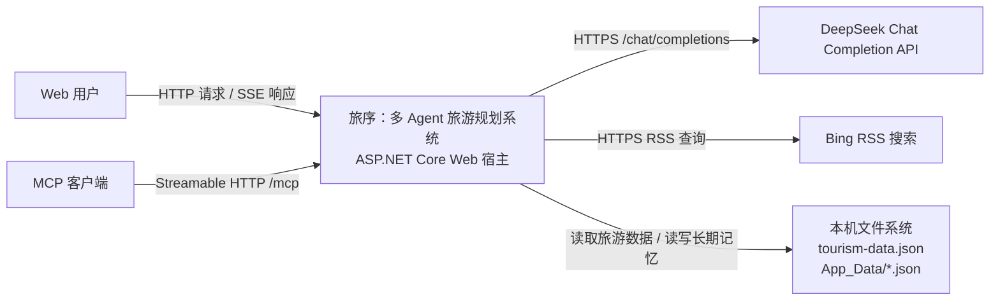

Web 用户通过同一宿主获取静态页面、提交旅行需求、接收流式规划事件并查询历史方案。MCP 客户端通过 **/mcp** 发现和调用旅游工具。系统在在线模式下调用 DeepSeek，在旅游网页检索工具执行时查询 Bing RSS，并直接访问本机旅游知识库和 JSON 长期记忆。

### 3.3 组件架构图与依赖关系


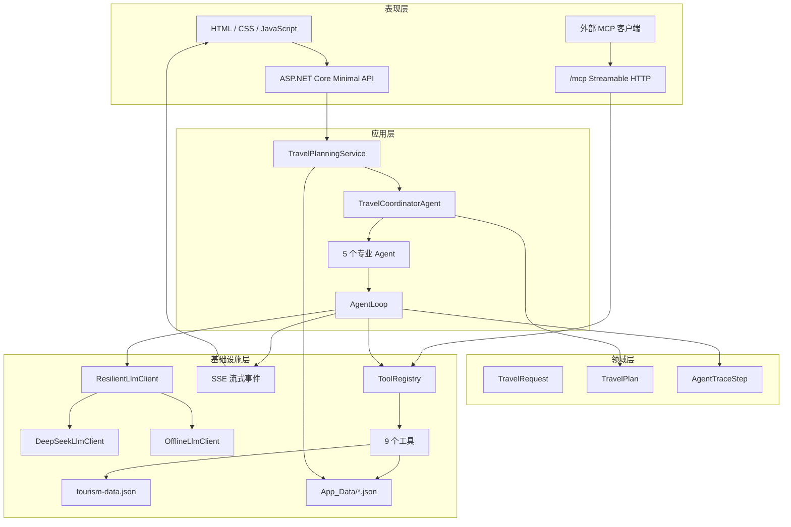

**TravelPlanningService** 是旅行方案生成的应用入口。它先规范化输入，再调用 **TravelCoordinatorAgent**，并在方案完成后使用 **PlanningMemoryStore** 保存结果。主控 Agent 直接编排行程、酒店、交通、风险和预算五个专业 Agent，并使用 **TourismCatalog** 参与结构化结果整合。

五个专业 Agent 将各自的职责、任务上下文和允许工具列表交给同一个 **AgentLoop**。**AgentLoop** 的核心执行依赖为 **ILlmClient** 和 **ToolRegistry**：前者通过 **ResilientLlmClient** 选择 DeepSeek 或离线决策引擎，后者负责查找并执行注册工具；循环步数来自 **AgentOptions**，执行状态通过日志记录。

内部 Agent 与 MCP Server 共用同一个 **ToolRegistry**。工具根据职责读取 **TourismCatalog**、读取用户长期记忆、执行确定性计算或发起 Bing RSS 查询。API、应用服务、Agent、LLM 客户端和工具使用 **Models** 中的 **record** 和枚举传递旅行需求、规划结果、工具定义、模型消息、执行轨迹和流式事件。

流式规划接口在 **Program.cs** 中创建 **Channel<PlanningStreamEvent>**。应用服务、主控 Agent 和 **AgentLoop** 通过规划进度回调产生事件，端点从 Channel 读取事件并以 SSE 写入浏览器。

### 3.4 逻辑模块职责

| 逻辑模块 | 主要源码 | 主要职责 |
| --- | --- | --- |
| Web 入口与表现 | **Program.cs**、**wwwroot/** | 托管静态页面，执行输入校验，提供 HTTP、SSE 和 MCP 入口 |
| 应用服务 | **Services/TravelPlanningService.cs** | 规范化旅行需求，基于旧方案构造修订请求，调用主控 Agent，保存完整方案 |
| Agent 编排 | **Agents/TravelCoordinatorAgent.cs**、**Agents/SpecialistAgents.cs** | 拆分专业任务，安排依赖与并发，汇总结果并生成 **TravelPlan** |
| ReAct 执行 | **Agents/AgentLoop.cs** | 维护消息、工具 Observation、执行轨迹和最大步骤循环 |
| 模型访问 | **Llm/** | 调用 DeepSeek、解析流式工具调用，并在不可用时切换到离线决策引擎 |
| 工具系统 | **Tools/** | 提供 JSON Schema、工具注册、统一执行和具体旅游查询与计算能力 |
| 数据与记忆 | **Infrastructure/**、**Data/**、**App_Data/** | 读取旅游知识库，保存和查询完整计划及用户画像 |
| MCP 适配 | **Mcp/TravelMcpTools.cs** | 将 9 个内部工具映射为 MCP 工具，并委托 **ToolRegistry** 执行 |
| 共享模型 | **Models/** | 定义 API、Agent、LLM、工具、旅行方案和流式事件的数据契约 |
| 配置选项 | **Options/**、**appsettings.json**、**.env** | 配置模型连接、模型参数、最大 Agent 步数和数据目录 |

依赖关系以规划用例为中心：Web 入口调用应用服务，应用服务调用主控 Agent，主控 Agent 调度专业 Agent，专业 Agent 进入共享循环，共享循环再访问模型和工具。工具系统与 MCP 适配层在 **ToolRegistry** 汇合，本地知识库和长期记忆由基础设施组件提供。

### 3.5 组合根、依赖注入与启动过程

**Program.cs** 集中完成系统装配。启动过程依次执行：

1. 查找并读取仓库根目录或项目目录中的 **.env**，随后加载系统环境变量，使系统环境变量覆盖 **.env** 中的同名配置。
2. 将 **DeepSeek** 和 **Agent** 配置节绑定为 **DeepSeekOptions** 与 **AgentOptions**，并配置 API JSON 的 camelCase 属性名和字符串枚举。
3. 注册 DeepSeek 类型化 **HttpClient** 和 **TravelWebResearch** 命名 **HttpClient**。旅游网页检索客户端设置 15 秒超时和固定 User-Agent。
4. 注册 LLM 入口、本地旅游知识库、长期记忆、工具注册表、9 个工具、共享 **AgentLoop**、五个专业 Agent、主控 Agent 和旅行规划服务。
5. 注册无状态 HTTP MCP Server，并从程序集发现 MCP 工具。
6. 构建 Web 应用，执行长期记忆 JSON 规范化，再启用默认页面和静态文件。
7. 映射运行状态、计划生成、流式计划、流式修订、历史计划、指定计划、用户记忆和 **/mcp** 端点，最后使用 **index.html** 处理前端回退路由。

核心规划组件、工具、Agent、旅游知识库和长期记忆以单例方式注册。**HttpClient** 由 **IHttpClientFactory** 管理。**DeepSeekOptions** 保存 API 地址、模型、API Key、超时、最大输出长度和温度；**AgentOptions** 保存最大循环步数和长期数据目录。

## 4. 多 Agent 体系与任务编排

### 4.1 Agent 体系与职责分工

系统包含一个主控 Agent 和五个专业 Agent。**TravelCoordinatorAgent** 是使用 C# 实现的确定性主控 Agent，负责控制任务顺序、传递依赖数据、整合专业结果和构建最终旅行方案。五个专业 Agent 分别承担行程、酒店、交通、风险和预算任务，并通过共享的 **AgentLoop** 完成各自的专业任务。

| Agent | 主要职责 | 任务输入 | 返回给主控 Agent 的结果 |
| --- | --- | --- | --- |
| 主控 Agent | 理解旅行目标，拆分任务，控制并发与依赖，汇总结果，检查预算冲突，生成最终方案 | 经规范化的旅行需求 | 完整 **TravelPlan** |
| 行程规划 Agent | 选择核心城市，查询候选体验，确定区域顺序和每日活动密度 | 原始旅行需求；第二轮规划时附加预算压缩指令 | 核心城市顺序、候选景点、联网行程资料和专业结论 |
| 酒店 Agent | 根据已选核心城市、总预算和住宿偏好推荐住宿 | 包含核心城市范围的旅行需求；第二轮规划时附加预算压缩指令 | 住宿候选和专业结论 |
| 交通 Agent | 查询交通资料，估算往返、市内和跨城交通费用与耗时 | 包含核心城市范围的旅行需求；第二轮规划时附加预算压缩指令 | 交通估算、联网交通资料和专业结论 |
| 风险 Agent | 检查签证、天气、自然灾害、社会治安、行程强度和个性化备注风险 | 原始旅行需求 | 风险、天气、联网风险资料和专业结论 |
| 预算 Agent | 汇总费用，判断是否超支，并生成预算优化建议 | 原始旅行需求和主控 Agent 计算的分类费用 | 预算明细、剩余预算、超支状态和优化建议 |

专业 Agent 不直接互相调用。所有跨专业数据都先返回主控 Agent，再由主控 Agent 解析、筛选、转换并传递给后续任务。酒店 Agent 和交通 Agent 使用主控 Agent 写入核心城市范围后的旅行需求；预算 Agent 使用主控 Agent 根据日程、住宿和交通结果计算出的费用上下文。

### 4.2 确定性主控与专业任务边界

主控 Agent 的规划规则直接写在 **TravelCoordinatorAgent.PlanAsync** 中，不通过 LLM 决定任务顺序。主控 Agent 固定执行以下工作：

1. 补全缺省出发日期并记录旅行目标。
2. 启动行程规划和风险检查，等待行程规划选定核心城市。
3. 将核心城市写入目的地和备注，形成酒店与交通使用的范围化需求。
4. 等待酒店、交通和风险任务完成，解析专业结果，并在缺少结构化结果时使用对应回退结果。
5. 根据核心城市、景点候选、交通结果和旅行节奏构建每日计划，选择住宿并计算费用明细。
6. 将分类费用交给预算 Agent 检查，根据预算结果决定是否启动第二轮规划。
7. 汇总风险、调整建议和专业贡献，构建最终 **TravelPlan**。

主控 Agent 不进入共享 **AgentLoop**，也不通过 **ToolRegistry** 直接执行专业工具。专业 Agent 负责在各自限定的职责内获取和整理专业结果，不负责决定整体编排顺序，也不直接生成最终旅行方案。五个专业 Agent 将任务委托给同一个 **AgentLoop** 并返回统一的 **AgentRunResult**，主控 Agent 再从专业结果中提取结构化数据和专业结论，继续执行后续编排。

### 4.3 多 Agent 编排时序图

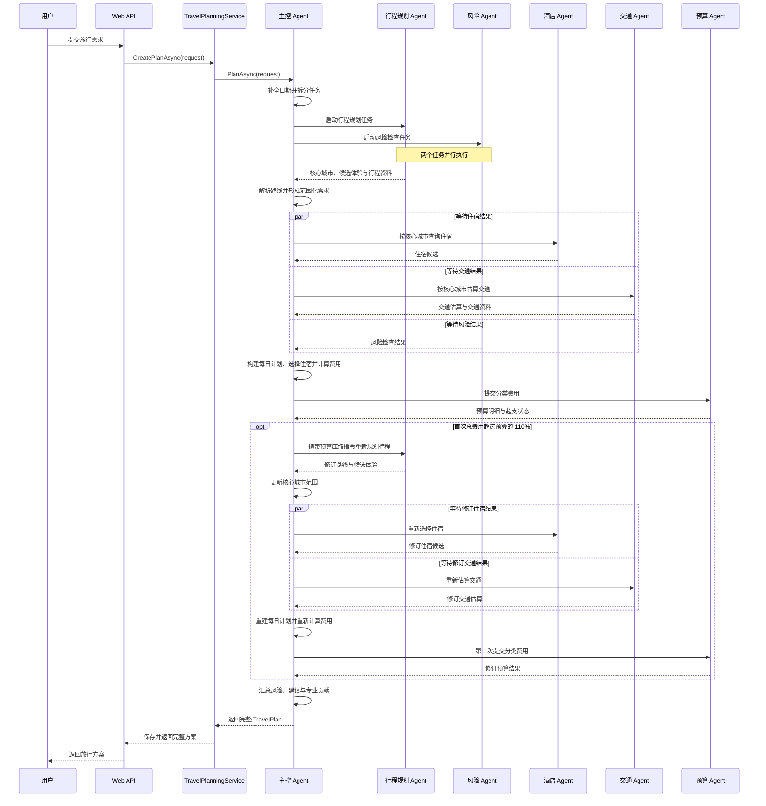

首批任务中，行程规划 Agent 与风险 Agent 同时启动。主控 Agent 必须先等待行程规划结果，因为酒店位置、跨城交通和最终每日路线都依赖已选核心城市。风险任务不依赖路线结果，因此可以继续并行执行。

核心城市确定后，主控 Agent 通过 **ApplyRouteScope** 将城市列表写入后续旅行需求，再同时启动酒店 Agent 和交通 Agent。主控 Agent 使用 **Task.WhenAll** 等待酒店、交通和仍在执行的风险任务，随后才开始构建每日计划和费用。

预算 Agent 最后执行，因为其输入来自主控 Agent 已完成的每日活动、住宿选择和交通估算。该顺序保证预算检查使用实际进入方案的费用，而不是独立生成的预算比例。

### 4.4 首轮结果整合与依赖传递

专业 Agent 返回后，主控 Agent 从结果中解析路线、景点、酒店、交通、联网资料、风险和预算。结果整合遵循以下依赖关系：

- 路线结果确定核心城市，并用于筛选景点候选、限定酒店与交通任务范围以及安排每日城市。
- 景点候选、路线顺序和旅行节奏共同决定每日活动数量、活动时段和城市分配。
- 交通结果参与抵达、跨城、返程和每日市内交通安排，并进入活动级费用明细。
- 酒店候选按照每日停留城市和每晚预算选择，住宿费用按旅行人数计算所需房间数。
- 每日活动费用、住宿费用和其他预留费用汇总为交通、住宿、餐饮、门票和其他五类预算输入。
- 风险结果独立汇总到最终方案，不参与核心城市、住宿和交通的首轮选择。

当专业结果缺失或不能解析时，主控 Agent 构建对应回退结果，然后继续完成后续依赖步骤。最终方案中的每日计划、住宿、交通和预算均由主控 Agent 根据结构化专业结果统一构建。

### 4.5 预算超限后的第二轮规划

首次预算结果满足 **budget.Total > request.Budget x 1.10m** 时，主控 Agent 将 **PlanningRevisionCount** 设置为 **1**，并生成压缩住宿与交通成本、减少高价或低优先级活动、保留核心偏好的修订指令。

第二轮规划按以下顺序执行：

1. 行程规划 Agent 使用原始旅行需求和修订指令重新规划行程。
2. 主控 Agent 解析修订路线，并重新生成包含核心城市的范围化需求。
3. 酒店 Agent 与交通 Agent 携带修订指令并行重新执行。
4. 主控 Agent 重新筛选景点、选择住宿、压缩交通目标费用，并以更低的活动密度重建每日计划。
5. 主控 Agent 重新计算费用，预算 Agent 执行第二次预算检查。

风险 Agent 不在第二轮重新执行，第二轮仍使用首轮风险结果。系统最多启动一次预算触发的重规划；第二次预算检查完成后，无论结果是否仍然超支，主控 Agent 都继续执行冲突检查和最终结果整合。

最终 **AgentContributions** 按 Agent 名称合并。发生第二轮规划时，行程、酒店、交通和预算 Agent 使用各自最后一次专业结论作为贡献摘要。主控 Agent 的贡献记录任务分解、冲突处理、结果整合以及是否执行第二轮规划。

## 5. ReAct 循环与 LLM 接入

### 5.1 AgentLoop 输入、状态与输出

**AgentLoop.RunAsync** 是五个专业 Agent 共用的 ReAct 执行入口。每次调用对应一个独立的专业子任务，循环接收以下输入：

| 输入 | 作用 |
| --- | --- |
| **agentName** | 标识当前专业 Agent |
| **responsibility** | 定义当前 Agent 的专业职责和输出约束 |
| **AgentTaskContext** | 包含旅行需求、当前子任务和可选共享上下文 |
| **allowedTools** | 限定当前 Agent 可以请求的能力 |
| **sequenceStart** | 为当前专业任务分配操作摘要的起始序号 |
| **CancellationToken** | 在请求取消时终止当前循环 |
| **onProgress** | 接收模型文本增量和操作阶段摘要 |

循环开始时，系统根据 **allowedTools** 获取当前 Agent 可用的能力定义，并创建两条初始消息：

- **system** 消息包含 Agent 名称、专业职责、事实约束、专有名称要求、允许能力和输出要求。
- **user** 消息包含子任务，并以 **<request>** 和 **<shared-context>** 标签封装旅行需求与共享上下文。

一次循环运行期间维护以下状态：

- **messages**：发送给 LLM 的消息序列；
- **observations**：按名称保存当前子任务获得的结构化结果；
- **calledToolNames**：记录已经请求过的能力；
- **toolCallCount**：统计实际执行次数；
- **trace**：记录 **Thought**、**Action**、**Observation** 和 **FinalAnswer** 操作摘要；
- **finalAnswer**：保存专业 Agent 最终提交的 Markdown 结论；
- **step**：限制循环执行次数，当前配置为最多 8 步。

循环结束后返回 **AgentRunResult**，其中包含 Agent 名称、专业结论、结构化结果、操作摘要、调用次数和当前模型模式。

### 5.2 ReAct 循环流程图

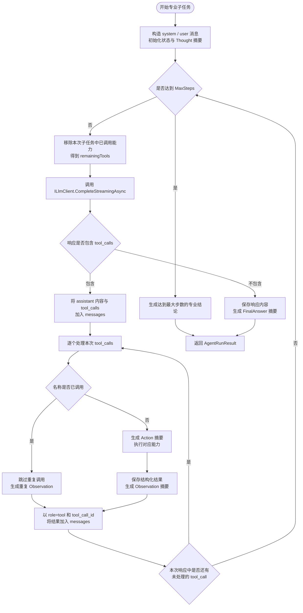

ReAct 循环的 **Thought** 是系统在子任务开始时生成的任务分析摘要。LLM 返回函数调用时形成 **Action**，执行结果形成 **Observation**；结果重新加入消息序列后，LLM 在下一步继续选择能力或提交专业结论。LLM 响应不再包含函数调用时，循环将响应内容作为 **FinalAnswer** 并结束。

系统提示明确要求专业 Agent 基于获得的事实数据工作，不编造实时价格、天气或政策；涉及景点和场所时使用真实、可搜索的专有名称，资料不足时明确标记需要联网确认。系统提示同时要求最终结论保持简洁、可核验，并禁止输出私有思维链。

### 5.3 函数调用消息与循环终止规则

**ChatMessage** 使用 **Role**、**Content**、**ToolCallId** 和 **ToolCalls** 表示对话消息。DeepSeek 请求中的消息按以下方式转换：

- 普通 **system**、**user** 和无函数调用的 **assistant** 消息发送 **role** 与 **content**；
- 包含函数调用的 **assistant** 消息发送 **content** 和 **tool_calls**；
- 执行结果作为 **role=tool** 消息发送，并携带对应的 **tool_call_id**。

当 LLM 请求一个或多个函数调用时，**AgentLoop** 先将完整的 **assistant** 响应加入 **messages**，再逐个执行请求，并将每个结果作为对应的 **tool** 消息加入 **messages**。函数调用请求由 **AgentLoop** 交给统一执行入口，LLM 不直接执行任意 C# 方法。下一次 LLM 请求能够读取此前的 Action 和 Observation，继续完成当前子任务。

每项能力在一次专业子任务中最多实际执行一次。循环每一步都会从下一次可用列表中移除已经执行的名称；如果模型仍请求重复名称，系统跳过执行并返回一条提示性 Observation，要求使用已有结果继续处理。

循环具有三种结束方式：

1. LLM 响应不包含函数调用，响应内容成为专业结论。
2. LLM 响应不包含函数调用且内容为空，使用“子任务已完成。”作为专业结论。
3. 循环达到 **AgentOptions.MaxSteps**，使用已获得的结果结束当前专业任务，并由主控 Agent 继续整合方案。

操作摘要中的 **Thought**、**Action**、**Observation** 和 **FinalAnswer** 由系统根据子任务、调用参数、执行结果和最终结论生成。DeepSeek 请求同时设置 **thinking.type=disabled**，系统不请求、保存或展示模型私有思维链。

### 5.4 DeepSeek 直接 HTTP 接入与流式响应聚合

**ILlmClient** 定义普通补全和流式补全两个方法，以及当前模型模式。**AgentLoop** 在每一步调用 **CompleteStreamingAsync**，使模型文本能够在完整响应结束前以增量形式交给进度回调。

**DeepSeekLlmClient** 使用 **HttpClient** 直接向 **{BaseUrl}/chat/completions** 发送请求，不依赖 DeepSeek SDK。请求使用 Bearer API Key，并包含：

- **model**：当前配置的模型名称；
- **messages**：当前 ReAct 消息序列；
- **stream**：由调用方式决定是否请求流式响应；
- **temperature** 和 **max_tokens**：模型生成参数；
- **thinking: { type: "disabled" }**：关闭模型思维链输出；
- **tools** 与 **tool_choice: "auto"**：当前步骤仍可请求的函数定义。

DeepSeek 配置由 **DeepSeekOptions** 提供，当前默认值为：

| 配置项 | 默认值 |
| --- | --- |
| API 地址 | **https://api.deepseek.com** |
| 模型 | **deepseek-v4-flash** |
| 请求超时 | 90 秒 |
| 最大输出长度 | 1800 tokens |
| 温度 | 0.3 |

流式补全使用 **HttpCompletionOption.ResponseHeadersRead** 读取 DeepSeek 返回的数据行。客户端忽略非 **data:** 行，在收到 **[DONE]** 时结束读取，并完成以下聚合：

- 持续拼接文本 **content**；
- 文本累计达到 24 个字符或遇到换行时触发一次增量回调；
- 按函数调用的 **index** 聚合被拆分到多个数据块中的调用 ID、函数名称和 JSON 参数；
- 保留响应中的 **finish_reason** 和实际模型名称；
- 最终构建统一的 **LlmResponse** 返回 **AgentLoop**。

普通补全方法读取完整 JSON 响应，并解析相同的文本、函数调用、结束原因和模型名称。两种补全方式向上层返回相同的 **LlmResponse** 数据结构。

### 5.5 模型模式选择、自动降级与离线决策引擎

**ResilientLlmClient** 是 **ILlmClient** 的实际注册实现，统一选择 DeepSeek 在线客户端或 **OfflineLlmClient**。模式选择与降级过程如下：

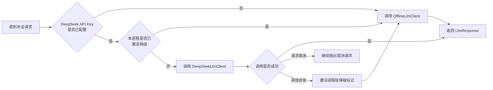

未配置 API Key 时，所有补全请求直接进入离线模式。DeepSeek 调用发生非取消异常时，**ResilientLlmClient** 激活 **_fallbackActivated**；当前请求改用离线决策引擎完成，当前进程后续的补全请求也继续使用离线模式。请求取消不会触发降级，而是继续向上抛出取消状态。

**OfflineLlmClient** 是确定性规则引擎，不生成开放式模型推理。每次调用时，它从当前消息中识别已经调用的名称，选择可用列表中的第一个未调用能力，根据旅行需求、共享上下文和子任务构造参数，并返回一个规范的函数调用。所有可用能力均已调用后，离线决策引擎返回不包含函数调用的完成响应，使 **AgentLoop** 提交专业结论。

离线流式方法复用同一确定性补全结果，并将完整文本一次性交给增量回调。在线与离线模式使用相同的 **AgentLoop** 消息结构、函数调用格式和终止规则，因此切换模型模式不会改变专业任务的外层执行流程。

## 6. 工具系统与数据来源

### 6.1 工具契约与统一执行入口

九个旅游工具均实现 **IAgentTool**。该接口要求每个工具提供一个 **ToolDefinition**，并实现异步 **ExecuteAsync** 方法：

- **ToolDefinition.Name**：函数调用使用的唯一名称；
- **ToolDefinition.Description**：向模型说明工具用途；
- **ToolDefinition.Parameters**：以 JSON Schema 描述输入字段、必填字段、类型和建议范围；
- **ExecuteAsync(arguments, cancellationToken)**：接收 JSON 参数字符串并返回 **ToolExecutionResult**。

JSON Schema 是发送给模型的函数调用契约，用于约束模型生成参数。工具执行时，**ToolSupport.Parse<T>** 使用统一的 JSON 配置将参数反序列化为各工具的内部输入类型；部分工具还会在执行逻辑中限制数量、筛选主题或生成缺省值。

**ToolRegistry** 在构造时接收全部九个工具，并按名称建立不区分大小写的字典。它提供两个统一入口：

1. **GetDefinition(name)** 返回指定工具的能力定义，供专业 Agent 获取其允许使用的工具描述。
2. **ExecuteAsync(name, arguments, cancellationToken)** 按名称定位并执行工具，返回统一的成功或失败结果。

未注册名称会返回失败结果。工具执行产生普通异常时，注册表将异常转换为包含错误信息的 **ToolExecutionResult**；请求取消则继续向上传递。工具成功结果和失败结果均使用 JSON 字符串作为内容，使专业 Agent 能够使用相同的数据格式继续处理。

### 6.2 工具设计表

| 工具 | 使用该工具的专业 Agent | 主要输入 | 主要输出 | 数据来源 | 结果边界 |
| --- | --- | --- | --- | --- | --- |
| **preference_memory** | 行程规划 Agent | 用户标识、当前偏好、旅行节奏和备注 | 既有用户画像、当前偏好、当前节奏、备注约束和记忆提示 | 已保存的用户画像 | 当前输入优先于历史偏好 |
| **route_sort** | 行程规划 Agent | 目的地、偏好、节奏、天数、预算、人数 | 有序核心城市、各城市建议天数、重点区域、每日活动密度、路线策略 | 本地旅游知识库、代码内城市范围与排序规则 | 普通旅行最多选择 3 个城市；满足长行程和人均日预算条件时可选择 4 个 |
| **travel_web_research** | 行程规划 Agent、交通 Agent、风险 Agent | 出发地、目的地、日期、天数、检索主题 | 按主题组织的网页标题、链接、摘要、发布时间、官方来源标记与错误信息 | Bing RSS 搜索、代码内官方入口回退 | 返回搜索摘要和来源入口，不等同于实时官方结论 |
| **attraction_search** | 行程规划 Agent | 目的地、偏好、最大结果数 | 带城市、名称、类别、区域、说明、门票、时长、标签和评分的候选体验 | 本地旅游知识库、代码内真实命名候选、待核验回退 | 返回数量限制为 1 至 20；门票为规划估算 |
| **hotel_search** | 酒店 Agent | 目的地、每晚预算、偏好 | 每晚预算、住宿候选和数据声明 | 本地旅游知识库、通用模拟住宿回退 | 酒店名称与价格用于规划，预订前需要重新查询 |
| **transport_estimate** | 交通 Agent | 出发地、目的地、天数、人数 | 往返方式与说明、往返费用、市内费用、跨城费用、耗时和路线提示 | 本地旅游知识库、确定性估算规则 | 费用和耗时不是实时票价与班次 |
| **weather_lookup** | 风险 Agent | 目的地、出发日期、天数 | 查询期间、城市季节天气和数据声明 | 本地旅游知识库中的季节天气 | 返回季节性参考，不是实时天气预报 |
| **risk_check** | 风险 Agent | 目的地、天数、节奏、备注、出发日期 | 签证、安全、行程强度、个性化约束和数据声明等风险项 | 本地旅游知识库、确定性风险规则 | 政策与安全信息需要在出行前复核 |
| **budget_calculator** | 预算 Agent | 预算上限、交通、住宿、餐饮、门票和其他费用 | 分类费用、总额、剩余预算、超支状态和优化建议 | 确定性计算 | 只计算输入费用，不自行查询价格 |

每个专业 Agent 只获得其职责所需的工具定义。行程规划 Agent 使用四个工具，交通 Agent 和风险 Agent 分别使用两个和三个工具，酒店 Agent 与预算 Agent 各使用一个工具。主控 Agent 不直接调用这些工具，而是解析专业 Agent 返回的结构化结果。

### 6.3 工具与数据来源关系

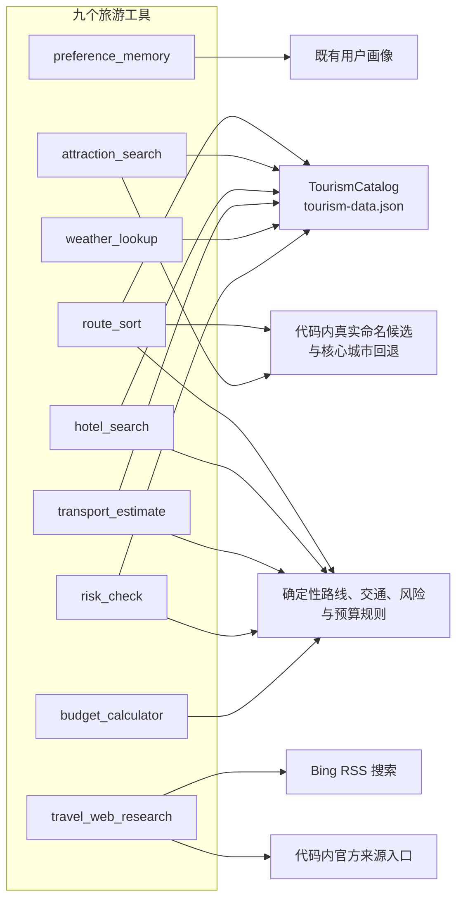

工具不会从单一来源生成全部结果。本地旅游知识库提供结构化城市资料；代码内回退数据补充部分目的地的真实命名景点、核心城市和官方信息入口；确定性规则负责路线数量、交通估算、风险判断、通用住宿和预算计算；联网检索工具提供带来源链接的网页摘要。

### 6.4 本地旅游知识库与确定性规则

**TourismCatalog** 使用延迟异步加载读取 **Data/tourism-data.json**。首次查询时，系统将 JSON 反序列化为 **TourismCatalogData**，后续查询复用同一份已加载数据。目的地查询会按顿号、逗号、斜杠、分号和空格拆分关键词，并使用国家、城市和别名进行包含匹配。

本地旅游知识库当前包含六个城市：

| 国家或地区 | 城市 | 景点数量 | 酒店数量 | 同时保存的数据 |
| --- | --- | ---: | ---: | --- |
| 日本 | 东京 | 6 | 3 | 餐饮日均费用、市内交通日均费用、签证提示、安全提示、四季天气 |
| 日本 | 京都 | 5 | 3 | 餐饮日均费用、市内交通日均费用、签证提示、安全提示、四季天气 |
| 日本 | 大阪 | 4 | 3 | 餐饮日均费用、市内交通日均费用、签证提示、安全提示、四季天气 |
| 中国 | 杭州 | 4 | 3 | 餐饮日均费用、市内交通日均费用、签证提示、安全提示、四季天气 |
| 中国 | 成都 | 4 | 3 | 餐饮日均费用、市内交通日均费用、签证提示、安全提示、四季天气 |
| 新加坡 | 新加坡 | 4 | 3 | 餐饮日均费用、市内交通日均费用、签证提示、安全提示、四季天气 |

知识库中的每个景点包含名称、类别、区域、说明、门票估算、建议时长和标签；每个酒店包含名称、区域、每晚价格、等级、推荐理由和评分。

基于本地知识库的工具按照各自规则生成结果：

- **attraction_search** 根据偏好词与景点标签的匹配数量计算候选评分，免费景点获得少量加分，再按评分排序。
- **route_sort** 从目的地匹配城市中提取景点集中区域，根据天数和人均日预算选择城市数量，并按照节奏给出每天 2、3 或 4 个活动的建议。当前城市选择和排序规则不使用传入的偏好文本。
- **hotel_search** 将超过每晚预算的候选降低评分，优先返回预算范围内且评分较高的住宿。当前排序规则不使用传入的住宿偏好文本。
- **transport_estimate** 根据同城、境内或境外旅行选择交通方式和单人往返基准费用，并结合天数、人数、市内交通日均费用和城市数量计算估算值。
- **weather_lookup** 根据出发月份映射春、夏、秋、冬，并读取对应季节天气。
- **risk_check** 将签证提示、安全提示、行程强度和用户备注转换为结构化风险项。出发日期属于输入契约，但当前风险规则不根据具体日期产生额外判断。
- **budget_calculator** 汇总五类输入费用，计算剩余预算和超支状态，并针对最大费用项生成优化建议。

### 6.5 命名候选、路线回退与联网研究

当 **attraction_search** 无法从本地旅游知识库获得候选时，它按目的地选择回退策略。香港、台湾和越南具有代码内维护的真实命名候选，包括具体景点、区域、说明、门票估算、建议时长、标签和评分。其他未知目的地返回“具体景点需联网确认”的待核验候选，不生成通用虚构景点名称。

当 **route_sort** 无法从本地旅游知识库获得城市列表时，它为越南、台湾和西欧提供代码内核心城市与区域列表；其他目的地使用目的地名称、代表性历史街区和公共交通便利区域形成通用路线范围。日本目的地在本地城市排序中优先采用东京、京都、大阪顺序。

**hotel_search** 在没有本地住宿候选时，根据输入的每晚预算生成交通枢纽、市中心和核心景区三个通用住宿筛选方案。其名称和价格明确属于模拟数据。

**travel_web_research** 支持 **itinerary**、**transport**、**food**、**visa**、**weather**、**disaster** 和 **safety** 七个主题。工具会去重并最多处理七个输入主题，各主题查询并行执行。每个主题根据目的地、日期和主题生成 Bing RSS 查询词，并完成以下筛选：

- 移除无有效标题或链接的结果；
- 排除代码中列出的低质量域名；
- 根据优选官方域名、主题关键词、目的地匹配和官方来源特征计算相关性分数；
- 对签证、天气、灾害和安全主题采用更严格的相关性要求；
- 按分数和发布时间排序，每个主题最多保留 5 条结果；
- 合并代码内官方来源入口并按 URL 去重。

台湾、香港和日本配置了按主题划分的优选官方域名和官方入口。其他目的地的签证、天气、灾害与安全主题可以回退到中国领事服务网、国家移民管理局、世界气象组织和 GDACS 等入口。联网结果保留标题、URL、摘要、发布时间和官方来源标记，并明确提示必须打开来源页面复核。

**travel_web_research** 的天数字段属于输入契约，当前查询词和结果筛选不根据天数变化。联网查询失败时，该主题返回空结果和错误文本；其他主题仍可继续返回结果。

### 6.6 工具结果的结构化使用

所有工具通过 **ToolSupport.Success** 将结果序列化为 JSON，并包装为成功的 **ToolExecutionResult**。专业 Agent 获得结果后，将其保存为以工具名称为键的结构化结果。主控 Agent 按名称读取需要的数据：

- 从 **route_sort** 读取 **RoutePlan**；
- 从 **attraction_search** 读取候选体验；
- 从 **hotel_search** 读取住宿候选；
- 从 **transport_estimate** 读取交通摘要；
- 从 **travel_web_research** 读取联网研究报告；
- 从 **risk_check** 和 **weather_lookup** 读取风险与天气信息；
- 从 **budget_calculator** 读取预算结果。

**preference_memory** 的结果用于行程规划 Agent 的专业结论，不由主控 Agent 单独解析。工具返回的 JSON 既为专业 Agent 提供事实数据，也为主控 Agent 提供可直接反序列化的结构化输入，避免只依赖专业结论中的自由文本生成最终方案。

## 7. Memory 与领域数据设计

### 7.1 Memory 生命周期与边界

系统中的 Memory 按生命周期分为专业 Agent 单次运行状态、主控 Agent 单次规划状态和跨规划长期记忆。三类状态分别服务于专业任务连续推理、旅行方案整合和历史偏好复用。

| Memory 类型 | 主要状态 | 生命周期 | 主要使用者 |
| --- | --- | --- | --- |
| 专业 Agent 短期记忆 | **messages**、**observations**、已调用名称、专业结论和操作摘要 | 一次专业 Agent 运行 | **AgentLoop** 与当前专业 Agent |
| 主控 Agent 工作记忆 | 专业结果、核心城市、每日计划、住宿选择、费用明细、预算上下文、风险和修订状态 | 一次完整旅行规划 | **TravelCoordinatorAgent** |
| 长期计划记忆 | 每份完整 **TravelPlan** | 跨规划、跨进程 | **PlanningMemoryStore** |
| 长期用户画像 | 历史旅行节奏、偏好、备注约束、历史日均预算、计划数量和更新时间 | 跨规划、跨进程 | **PlanningMemoryStore** 与 **preference_memory** |

专业 Agent 的消息与 Observation 保留在当前专业任务中。主控 Agent 将专业贡献、操作摘要和结构化结果汇总到最终 **TravelPlan**，并随完整方案保存。

长期记忆使用本机 JSON 文件。运行时数据目录由 **AgentOptions.DataDirectory** 指定，当前默认值为 **App_Data**；该目录已加入 **.gitignore**，不会随源码提交。

### 7.2 Memory 生命周期与数据流

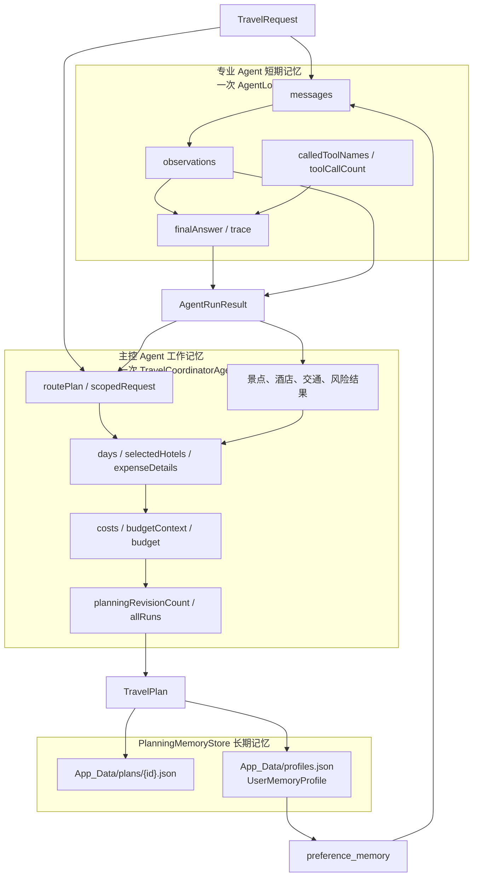

**TravelRequest** 同时进入专业 Agent 短期记忆和主控 Agent 工作记忆。专业 Agent 返回 **AgentRunResult** 后，主控 Agent 将各专业结果转化为路线、日程、费用和预算状态，最终构建 **TravelPlan**。后续修改计划时，**TravelPlanningService.RevisePlanAsync** 会把上一版计划摘要和用户修改要求写入新的 **TravelRequest**，因此新一轮专业 Agent 可以看到旧方案关键日程、预算和本轮变更意图。完整计划保存后更新用户画像；后续行程规划 Agent 可以通过 **preference_memory** 读取画像，并将其作为当前专业任务的 Observation。

### 7.3 专业 Agent 短期记忆与主控工作记忆

专业 Agent 短期记忆由 **AgentLoop.RunAsync** 内部的局部变量组成：

- **messages** 保存当前子任务的 system、user、assistant 和 tool 消息；
- **observations** 按名称保存当前子任务获得的 JSON 结果；
- **calledToolNames** 记录已经请求过的能力，避免在同一子任务中重复执行；
- **toolCallCount** 记录实际执行次数；
- **trace** 保存当前专业任务的阶段摘要；
- **finalAnswer** 保存专业 Agent 最终提交的结论。

**AgentTaskContext.SharedContext** 用于向专业 Agent 传入当前规划中的额外状态。预算 Agent 接收主控 Agent 计算的五类费用和预算上限；第二轮行程规划 Agent 接收预算压缩指令。用户主动修改行程时，修订要求和上一版摘要保存在 **TravelRequest** 中，并随请求进入所有专业任务。该共享上下文的生命周期限于当前规划。

主控 Agent 工作记忆存在于一次 **PlanAsync** 调用中，主要包括：

- 行程 Agent 返回的 **routePlan**，以及写入核心城市后的 **scopedRequest**；
- 各专业 Agent 的 **AgentRunResult** 和解析后的结构化结果；
- 当前方案的 **days**、**selectedHotels**、**transport**、**expenseDetails** 和 **costs**；
- 传给预算 Agent 的 **budgetContext** 和返回的 **budget**；
- 第二轮预算重规划使用的 **planningRevisionCount**、修订指令和修订结果；
- 用户主动修改计划时携带的上一版方案摘要、修改要求和新一轮专业结果；
- 汇总后的专业贡献和最终旅行方案。

跨规划保留的数据由最终构建并保存的 **TravelPlan** 和随之更新的 **UserMemoryProfile** 构成。

### 7.4 长期计划存储与用户画像聚合

**TravelPlanningService** 在主控 Agent 返回完整方案后调用 **PlanningMemoryStore.SavePlanAsync**。保存过程在同一个 **SemaphoreSlim** 临界区内依次完成计划写入和用户画像更新，避免同一进程中的多个保存操作同时覆盖 **profiles.json**。

每份完整计划使用计划 ID 作为文件名，保存路径为：

```text
App_Data/plans/{TravelPlan.Id:N}.json
```

计划文件保存完整 **TravelPlan**，包括旅行需求、每日计划、住宿、交通、预算、风险、费用明细、调整建议、专业贡献、操作摘要、规划轮次和模型模式。修订计划会保存为新的计划文件，并在 **TravelRequest.PreviousPlanId**、**RevisionNumber**、**RevisionInstruction** 和 **PreviousPlanSummary** 中记录与上一版的关系。读取单份计划时使用计划 ID 定位对应文件。

所有用户画像集中保存在：

```text
App_Data/profiles.json
```

**profiles.json** 使用用户标识作为键，值为 **UserMemoryProfile**。每次保存计划时，画像按以下规则更新：

- 将本次旅行节奏写入历史节奏集合，去重后保留轻松、均衡和充实等实际出现过的节奏；
- 将本次偏好按 **、**、中英文逗号、斜杠和中英文分号拆分，去除空白并与既有偏好合并；
- 偏好按不区分大小写去重，最多保留 12 项；
- 将本次备注与约束按分隔符拆分并合并，最多保留 12 项；
- 计划数量加 1；
- 使用本次 **预算 ÷ 天数** 更新历史日均预算的累计平均值；
- 将更新时间设置为当前 UTC 时间。

**preference_memory** 读取 **UserMemoryProfile**，同时返回本次偏好、旅行节奏和备注约束。没有既有画像时返回计划数量为 0 的空画像；存在历史画像时，工具提示规划可以参考历史偏好，但当前输入始终具有更高优先级。

近期计划读取会先按文件最后修改时间从新到旧扫描候选计划，再按用户标识过滤，并最终按照 **TravelPlan.CreatedAt** 降序返回指定数量。长期记忆属于单机文件存储，数据按 **UserId** 进行逻辑归属。

### 7.5 JSON 编码与已有数据规范化

长期记忆使用 Web 默认命名规则、缩进格式和 **JavaScriptEncoder.UnsafeRelaxedJsonEscaping** 序列化，使中文内容直接保存在 JSON 文件中。保存完整计划时，系统还会将序列化结果中的 Unicode 代理项对转换为实际字符，使表情等补充字符保持可读。

应用启动时调用 **NormalizeStoredJsonAsync**，扫描 **profiles.json** 和计划目录中的 JSON 文件。仅当文件包含 **\u** 转义时执行规范化：

1. 将文件解析为 **JsonNode**；
2. 递归处理对象、数组和字符串值；
3. 对包含嵌入 JSON 的字符串重新序列化，使其中的中文转义恢复为可读文本；
4. 对无法作为完整 JSON 解析的截断摘要直接解码 Unicode 转义，并移除末尾不完整转义；
5. 解码代理项对；
6. 先写入临时文件，再覆盖原文件。

该启动规范化过程用于迁移已有文件中的 Unicode 转义格式，并保持 **TravelPlan** 和 **UserMemoryProfile** 的数据结构。

### 7.6 领域模型结构

领域数据使用 **record**、枚举和只读集合接口表达。**TravelPlan** 是最终聚合根，关联旅行需求、行程、住宿、交通、预算、风险、费用明细、专业贡献和操作摘要。

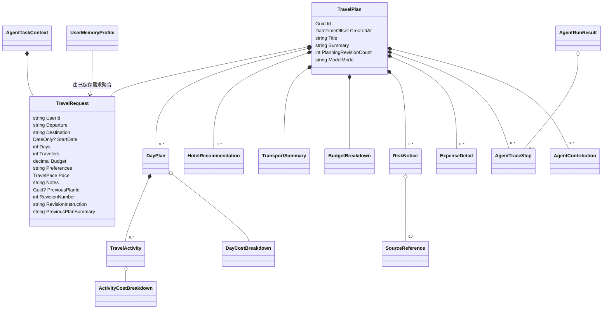

核心领域模型职责如下：

| 模型组 | 主要模型 | 表达内容 |
| --- | --- | --- |
| 旅行输入 | **TravelRequest**、**TravelPace**、**TravelPlanRevisionRequest** | 用户标识、路线、日期、天数、人数、预算、偏好、节奏、备注和修订上下文 |
| 完整方案 | **TravelPlan** | 最终旅行方案聚合、规划轮次和模型模式 |
| 每日行程 | **DayPlan**、**TravelActivity** | 每日城市、主题、活动时段、地点、说明、来源和费用 |
| 费用 | **ActivityCostBreakdown**、**DayCostBreakdown**、**ExpenseDetail**、**BudgetBreakdown** | 活动、日期、明细和总预算四个层级的费用数据 |
| 住宿与交通 | **HotelRecommendation**、**TransportSummary** | 住宿候选、交通方式、费用、耗时和路线提示 |
| 风险与来源 | **RiskNotice**、**SourceReference** | 风险等级、类别、说明、建议和来源链接 |
| Agent 结果 | **AgentRunResult**、**AgentTaskContext**、**AgentContribution**、**AgentTraceStep** | 专业任务上下文、结构化结果、专业贡献和操作摘要 |
| 长期画像 | **UserMemoryProfile** | 历史旅行节奏、用户偏好、备注约束、历史日均预算、计划数量和更新时间 |

路线选择、候选景点和联网研究还分别使用 **RoutePlan**、**RouteCityPlan**、**AttractionCandidate**、**WebResearchReport**、**WebResearchSection** 和 **WebResearchItem** 作为规划期间的结构化中间数据。这些模型由专业 Agent 和主控 Agent 使用；整合进入 **TravelPlan** 字段或操作摘要的数据随完整方案持久化。

## 8. Web、SSE 与 MCP 接口设计

ASP.NET Core 宿主同时提供静态 Web 页面、Minimal API、SSE 流式规划接口和 MCP Streamable HTTP 接口。HTTP JSON 与 SSE 事件数据均使用 camelCase 属性名，枚举值使用 camelCase 字符串。

### 8.1 Web 入口与 Minimal API 清单

**Program.cs** 通过 **UseDefaultFiles** 和 **UseStaticFiles** 提供 **wwwroot** 中的原生 HTML、CSS 和 JavaScript 文件，并通过 **MapFallbackToFile("index.html")** 将其他页面路径回退到首页。静态文件响应设置为不缓存，使页面始终加载当前资源。

系统提供 7 个 Minimal API 端点：

| 方法与路径 | 输入 | 成功响应 | 其他响应与接口行为 |
| --- | --- | --- | --- |
| **GET /api/status** | 无 | 当前模型模式、模型名、配置状态、MCP 信息和状态消息 | MCP 信息固定包含 **/mcp**、**streamable-http** 和 9 个工具 |
| **POST /api/plans** | JSON **TravelRequest** | **200 OK** 与完整 **TravelPlan** | 输入不符合约束时返回 **400** 验证问题；供非流式客户端使用 |
| **POST /api/plans/stream** | JSON **TravelRequest**，请求头接受 **text/event-stream** | **200 OK** 与连续 SSE 事件 | 输入不符合约束时在建立 SSE 前返回 **400** JSON |
| **POST /api/plans/{id:guid}/revise/stream** | JSON **TravelPlanRevisionRequest**，请求头接受 **text/event-stream** | **200 OK** 与连续 SSE 事件，最终返回新的 **TravelPlan** | 修改要求为空返回 **400**；旧计划不存在返回 **404** |
| **GET /api/plans?userId={userId}** | 可选用户标识；省略时使用 **demo-user** | **200 OK** 与最多 12 份近期 **TravelPlan** | 按用户标识读取近期方案 |
| **GET /api/plans/{id:guid}** | 计划 ID | **200 OK** 与指定 **TravelPlan** | 对应计划不存在时返回 **404 Not Found** |
| **GET /api/memory/{userId}** | 用户标识 | **200 OK** 与 **UserMemoryProfile** | 返回指定用户的长期画像 |

Web 页面默认使用 **POST /api/plans/stream**。**POST /api/plans** 调用同一个 **TravelPlanningService.CreatePlanAsync**，返回相同的最终 **TravelPlan**，区别仅在于响应传输方式。修订端点先读取旧计划，再由 **TravelPlanningService.RevisePlanAsync** 生成包含上一版摘要和修改要求的新请求，随后复用同一套流式推送器。

### 8.2 原生 Web 客户端交互流程

浏览器加载页面后并行请求运行状态、近期方案和用户画像。运行状态显示在页头模式徽标中，近期方案数量和用户画像显示在历史方案抽屉中。

用户提交规划表单后，**app.js** 将表单转换为 **TravelRequest** JSON，并使用 **fetch** 向流式端点发送请求。规划期间，页面打开 Agent 实时对话层，持续显示模型文本、系统阶段、工具调用和工具返回。收到 **completed** 事件后，页面使用其中的完整计划渲染以下五个结果页签：

| 页签 | 主要展示内容 |
| --- | --- |
| 方案总览 | 方案摘要、预算状态、Agent 分工、行程亮点和本次运行证据 |
| 每日行程 | 按日期展示城市、主题、活动时段、地点、说明、来源和费用 |
| 预算交通 | 费用分类、预算建议以及分类支出明细 |
| 风险提醒 | 风险等级、类别、说明、建议和来源链接 |
| Agent 轨迹 | 用户需求、Agent 阶段摘要、工具调用参数与工具返回摘要 |

规划完成后，浏览器重新请求近期方案和用户画像。用户从历史方案抽屉选择计划时，页面通过 **GET /api/plans/{id:guid}** 加载并渲染对应方案。用户在 Agent 轨迹页提交后续修改要求时，浏览器调用 **POST /api/plans/{id:guid}/revise/stream**，在实时对话层展示新一轮 Agent 协作，并在 **completed** 事件后使用新计划替换当前页面内容。

### 8.3 SSE 双层流式链路

在线模式包含两层连续流式传输：**DeepSeekLlmClient** 接收 DeepSeek Chat Completion 的 SSE 数据块，**AgentLoop** 将文本增量转换为 **delta** 事件；Web 流式端点再将 **PlanningStreamEvent** 写成面向浏览器的 SSE 帧。离线模式通过同一个内容增量回调发送模型结果，因此浏览器消费流程保持一致。

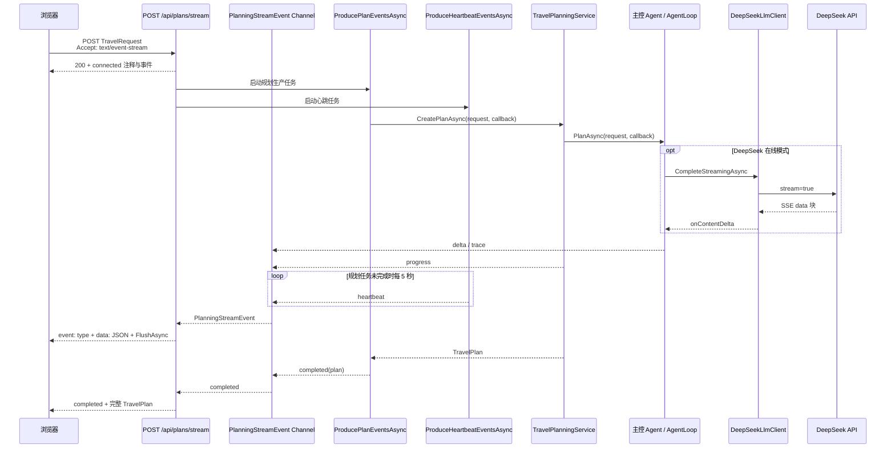

流式端点建立连接后设置：

- 状态码为 **200 OK**；
- **Content-Type** 为 **text/event-stream; charset=utf-8**；
- **Cache-Control** 为 **no-cache, no-transform**；
- **X-Accel-Buffering** 为 **no**；
- 关闭 ASP.NET Core 响应缓冲；
- 先写入带填充内容的 **connected** 注释，再写入结构化 **connected** 事件。

规划事件进入无界 **Channel<PlanningStreamEvent>**。Channel 使用单读取者和多写入者配置，使规划回调与心跳任务可以写入同一事件流。每个事件按以下格式写入，并在写入后立即刷新响应体：

```text
event: {PlanningStreamEvent.Type}
data: {PlanningStreamEvent 的 JSON}

```

### 8.4 流式事件契约与浏览器消费

**PlanningStreamEvent** 是 Web 流式接口的统一事件契约，包含 **type**、**messageId**、**agent**、**phase**、**title**、**detail**、**toolName**、**success**、**percent**、**plan** 和 **timestamp**。

| **type** | 生产位置 | 浏览器用途 |
| --- | --- | --- |
| **connected** | 流式端点 | 标记 SSE 连接已经建立 |
| **delta** | **AgentLoop** 的模型内容增量回调 | 按 **messageId** 合并并即时更新同一条 Agent 回复 |
| **trace** | 主控 Agent 与 **AgentLoop** | 展示阶段摘要、工具 Action、工具 Observation 和 Final Answer |
| **progress** | **TravelPlanningService** | 展示方案保存进度 |
| **heartbeat** | 流式端点心跳任务 | 每 5 秒报告连接仍在继续 |
| **completed** | 规划生产任务 | 携带最终完整 **TravelPlan**，结束页面规划流程 |
| **error** | 规划生产任务 | 携带流式规划失败信息 |

浏览器通过 **response.body.getReader()** 逐块读取响应，使用 **TextDecoder** 解码文本，将换行统一为 **\n**，再按空行拆分 SSE 块。**parseSseBlock** 分别读取 **event:** 和 **data:** 行，**data** 解析为 **PlanningStreamEvent** 后交给 **handlePlanningEvent**。

浏览器为连接建立设置 15 秒等待时间，并为每次流读取设置 20 秒等待时间；中止请求时，**AbortController** 的信号终止浏览器请求，对应的服务器请求取消令牌随之结束规划流。**completed** 事件中的计划用于渲染结果页面，**error** 事件中的说明用于显示请求错误。

**delta** 事件以 **messageId** 聚合同一条回复，Final Answer 到达后将该回复标记为完成。**trace** 事件展示可观察的任务阶段摘要、工具调用参数和工具返回摘要，不展示模型私有思维链。完整计划中的轨迹可在规划结束后通过 Agent 轨迹页签回放。

### 8.5 MCP Streamable HTTP 接口

系统使用 **ModelContextProtocol.AspNetCore 1.4.0** 注册 MCP Server，以无状态 HTTP 传输方式映射到：

```text
http://localhost:<运行端口>/mcp
```

MCP 客户端可以通过该端点执行 **initialize**、**tools/list** 和 **tools/call**。**TravelMcpTools** 使用 **[McpServerToolType]** 声明工具类型，使用 **[McpServerTool]** 和参数描述提供工具发现元数据，并将每次调用委托给同一个 **ToolRegistry**。

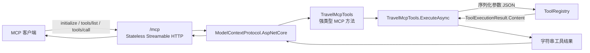

MCP Server 可发现并调用以下 9 个工具：

```text
attraction_search    route_sort           hotel_search
transport_estimate   budget_calculator    weather_lookup
risk_check           preference_memory    travel_web_research
```

所有 MCP 工具均标记为 **readOnly=true**、**destructive=false** 和 **idempotent=true**。其中 8 个本地查询、记忆读取和确定性计算工具标记为 **openWorld=false**；执行联网检索的 **travel_web_research** 标记为 **openWorld=true**。

**TravelMcpTools** 的公开方法使用强类型参数，运行时注入 **ToolRegistry** 和 **CancellationToken**。适配层将参数序列化为 Web JSON，按内部工具名称执行，并将 **ToolExecutionResult.Content** 作为 MCP 工具结果返回。**GET /api/status** 同时返回 MCP 是否启用、端点、传输类型和工具数量。

### 8.6 Web 界面与接口呈现

主页展示当前模型模式、历史方案数量和旅行需求表单；表单提交后进入 SSE 实时规划流程。

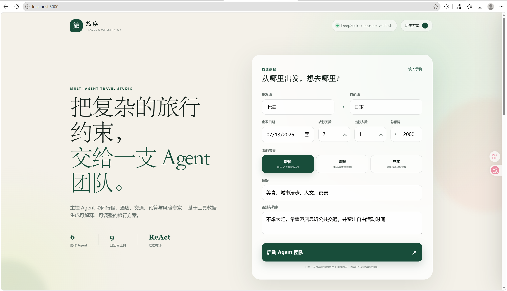

Agent 轨迹页将用户需求、阶段摘要、工具调用和返回结果按对话形式回放。

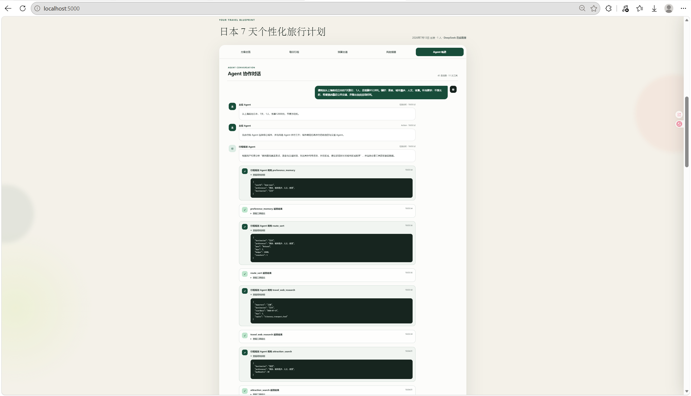

历史旅行方案抽屉组合展示用户偏好画像和近期方案，并支持选择计划后重新加载完整结果。

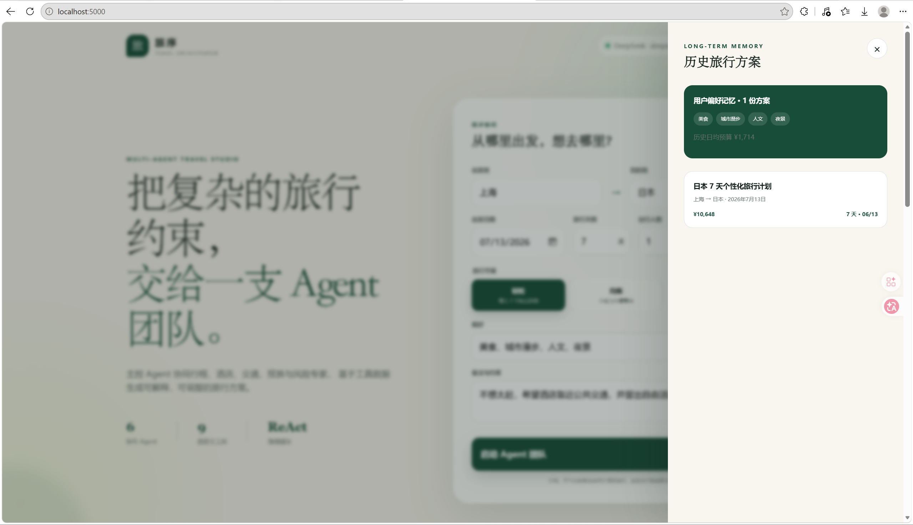

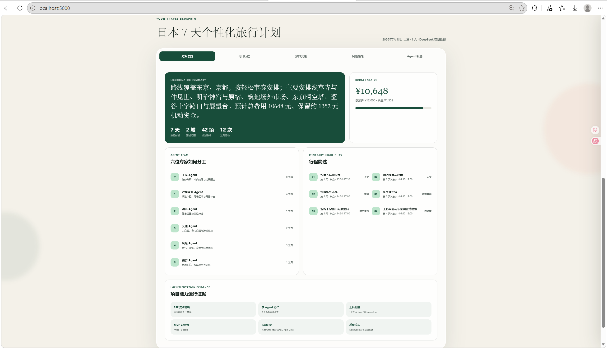

## 9. 可靠性、可观测性与测试

系统在输入、模型、工具、联网查询、Memory 和流式响应边界分别处理失败，并通过结构化轨迹、运行日志和自动化测试验证关键行为。

### 9.1 故障隔离与可观测反馈

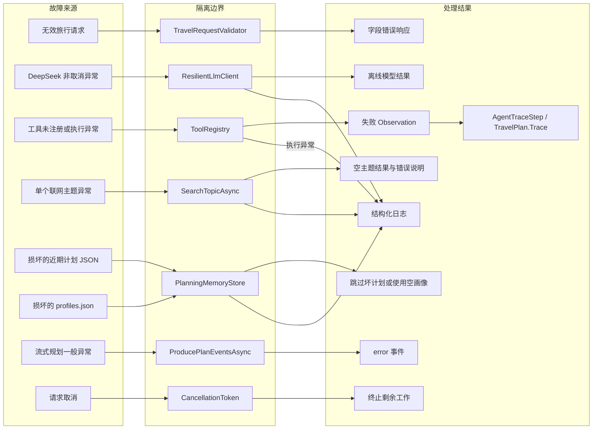

### 9.2 异常边界与局部恢复

规划入口在启动 Agent 前一次收集全部字段错误。DeepSeek 返回非成功状态码时，**DeepSeekLlmClient** 记录状态码与响应，并抛出包含 API 错误说明的 **HttpRequestException**；非取消异常由 **ResilientLlmClient** 转换为离线模型结果。

**ToolRegistry** 对未注册工具返回失败 **ToolExecutionResult**。已注册工具执行异常时记录错误，并将异常信息转换为失败 JSON；**AgentLoop** 将失败结果写入 Observation 和轨迹后继续执行。联网检索按主题并行运行，单个主题查询异常时返回包含错误说明的空 **WebResearchSection**，其他主题结果仍可组成研究报告。

JSON Memory 使用三种局部恢复方式：启动规范化遇到无效 JSON 时跳过对应文件；读取近期计划时跳过损坏计划；读取无效 **profiles.json** 时记录警告并返回空画像。

流式规划生产任务将一般异常转换为 **error** 事件，并在结束时完成事件 Channel。客户端断开导致请求取消时，规划任务和心跳任务结束，不再写入最终事件。

### 9.3 可观测数据与运行日志

可观测数据由 **AgentTraceStep**、**AgentContribution**、**TravelPlan.ModelMode** 和结构化日志组成。主控 Agent 将专业轨迹按顺序号合并到 **TravelPlan.Trace**；工具失败 Observation、预算修订动作和最终整合结论均可以在已保存方案中回放。专业贡献记录职责摘要和工具调用次数，模型模式字段标识最终方案使用的执行模式。

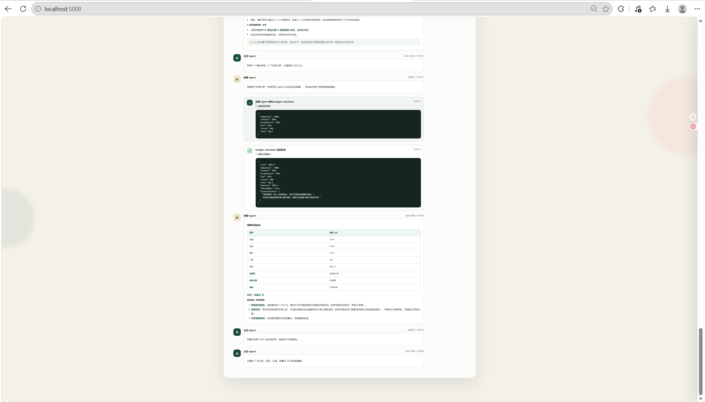

运行日志使用 **Microsoft.Extensions.Logging**，主要记录：

| 日志来源 | 记录内容 |
| --- | --- |
| **Program** | 本地 **.env** 配置文件加载位置 |
| **TourismCatalog** | 本地知识库加载完成及目的地数量 |
| **DeepSeekLlmClient**、**ResilientLlmClient** | DeepSeek 非成功响应和自动切换离线模型 |
| **ToolRegistry**、**TravelWebResearchTool** | 工具执行参数、工具异常和联网主题查询异常 |
| **AgentLoop** | Agent 名称、工具调用次数和模型模式 |
| **TravelCoordinatorAgent** | 计划 ID、总费用和预算上限 |
| **PlanningMemoryStore** | 计划保存、Unicode 规范化和损坏 JSON 跳过 |

默认日志级别为 **Information**，ASP.NET Core 与系统 HTTP 客户端日志级别为 **Warning**；开发环境将 **DotNetAgentDev** 日志级别设置为 **Debug**，可以显示 **ToolRegistry** 的工具执行日志。

### 9.4 取消传播与安全边界

规划与数据查询 API 入口、规划服务、Agent、LLM 客户端、工具和 Memory 访问使用 **async**/**await** 与 **CancellationToken**。请求取消令牌沿规划调用链向下传递，耗时循环和文件遍历主动检查取消状态。

**ResilientLlmClient**、**ToolRegistry** 和 **TravelWebResearchTool** 在捕获 **OperationCanceledException** 时继续抛出，不将取消误判为模型降级、工具失败或联网查询失败。流式生产任务与心跳任务同样识别请求取消并结束执行。

默认配置中的 API Key 为空，DeepSeek API Key 从本地配置或环境变量读取，**.env** 已加入 **.gitignore**。**AllowedHosts** 仅包含 **localhost**、**127.0.0.1** 和 **[::1]**。

Web 页面在渲染文本字段时调用 **escapeHtml**，Markdown 渲染也先执行 HTML 转义。来源链接通过 **safeUrl** 限制为 **http** 或 **https** 协议，并使用新窗口与 **noreferrer** 打开。

### 9.5 xUnit 自动化测试与验证结果

测试工程以 **.NET 10** 为目标框架，使用 xUnit、**Microsoft.NET.Test.Sdk** 和 **coverlet.collector**。测试通过离线模型、内存配置、临时目录、Stub HTTP Handler 和 Stub HTTP Client Factory 隔离外部依赖。

| 测试类 | 执行用例数 | 验证内容 |
| --- | ---: | --- |
| **TravelRequestValidatorTests** | 2 | 正常请求和全部重要输入边界错误 |
| **BudgetCalculatorToolTests** | 2 | 超预算判断、剩余额度和优化建议 |
| **TourismToolTests** | 6 | 偏好排序、真实命名地点、宽范围路线选城和未知目的地住宿回退 |
| **OfflineLlmClientTests** | 1 | 离线模型按允许工具顺序调用并最终停止 |
| **DeepSeekStreamingTests** | 1 | DeepSeek SSE 文本、工具 ID、工具名称和参数分片重组 |
| **TravelCoordinatorTests** | 2 | 预算超限二次规划、费用明细、事件元数据、选城顺序和真实地点 |
| **PlanningMemoryStoreTests** | 2 | 中文与补充字符可读保存、已有 Unicode 转义规范化 |
| **McpToolTests** | 2 | 9 个 MCP 工具声明和共享 **ToolRegistry** 调用 |
| **DotEnvConfigurationTests** | 2 | 常见 **.env** 语法、注释处理和仓库级文件查找 |

测试源码包含 20 个 **[Fact]** 和 1 个带 3 组 **[InlineData]** 的 **[Theory]**，共执行 23 个测试用例。本次验证执行：

```bash
dotnet restore
dotnet test
```

执行结果为 23 个测试通过、0 个失败、0 个跳过，目标框架为 **net10.0**。
