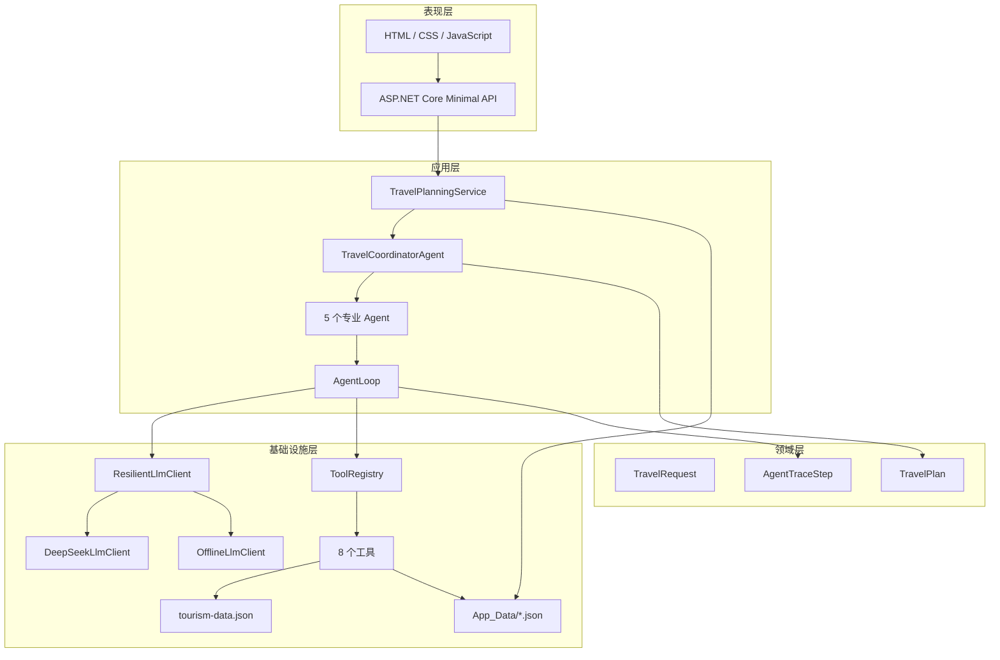
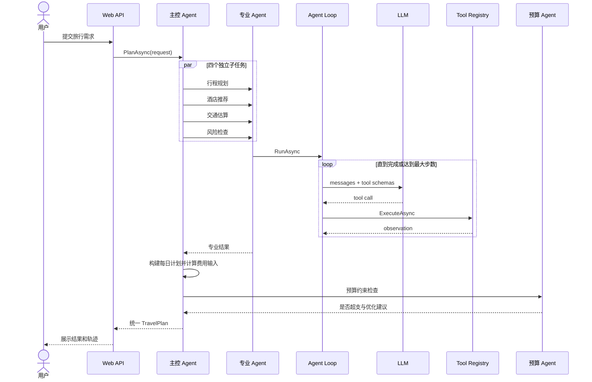
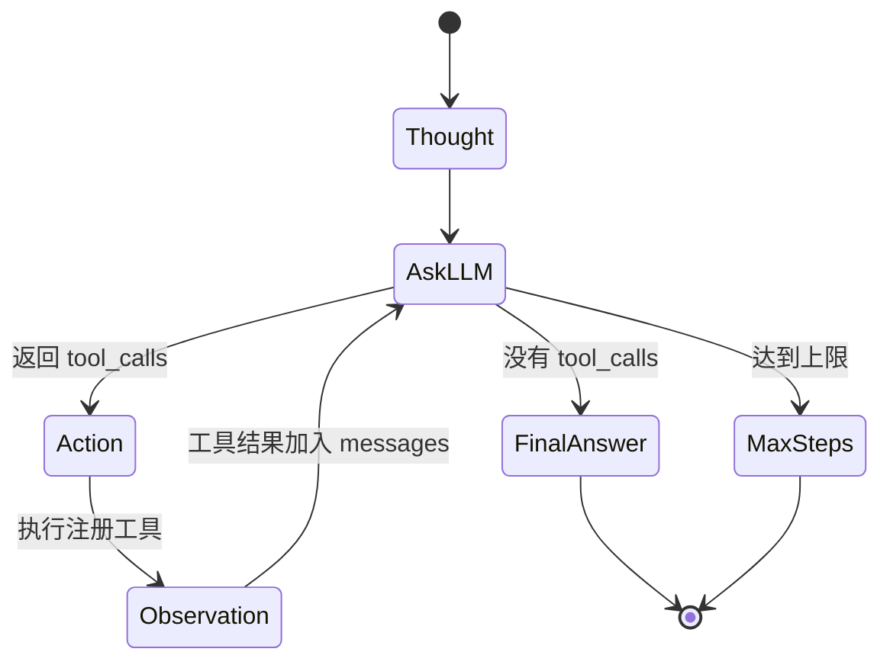
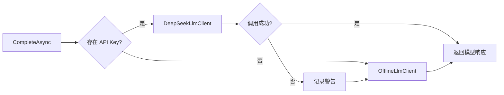

# 多 Agent 旅游规划系统架构设计

## 1. 设计目标

系统需要满足课程项目的五个核心要求：

1. 通过 HTTP 接入 DeepSeek 大语言模型。
2. 自主实现 ReAct Agent Loop。
3. 提供不少于 3 个自定义工具。
4. 具备短期工作记忆与长期用户记忆。
5. 提供可现场演示的 Web 用户界面。

同时采用多 Agent、单元测试和可观测执行轨迹作为加分项。

## 2. 分层架构

### 表现层

`Program.cs` 暴露计划生成、历史计划、用户记忆和运行状态 API。前端不依赖第三方框架，便于离线演示和解释。

### 应用层

`TravelPlanningService` 负责输入标准化和保存结果。`TravelCoordinatorAgent` 负责任务编排，不直接承担每个专业领域的工具选择。

### 领域层

领域模型使用不可变 `record`，包括旅行需求、每日行程、酒店、交通、预算、风险和执行轨迹。

### 基础设施层

DeepSeek、离线决策引擎、本地数据、JSON 记忆和工具实现都位于基础设施边界内，可替换而不影响 Web 和领域模型。

## 3. 多 Agent 协作

行程、酒店、交通和风险互不依赖，主控 Agent 使用 `Task.WhenAll` 并行执行。预算必须依赖前述实际估算，因此在第二阶段串行执行。

## 4. ReAct 核心循环

`AgentLoop.RunAsync` 的状态由 `messages`、`trace`、`observations` 和步数共同组成：

重要设计：

- 每个专业 Agent 只获得允许使用的工具 Schema。
- 工具调用必须通过 `ToolRegistry`，模型无法直接执行任意 C# 方法。
- Observation 作为 `role=tool` 消息和 `tool_call_id` 一起返回模型。
- 最大步数防止无限循环。
- 用户可见轨迹是系统操作摘要，不保存或展示模型私有思维链。

## 5. LLM 与降级设计

`ResilientLlmClient` 是业务层唯一依赖的 LLM 接口实现。

在线客户端直接使用 `HttpClient` 调用 `/chat/completions`，避免引入额外 SDK。离线客户端不会伪造自由文本模型，而是按允许工具列表依次生成规范函数调用，适合课堂演示和自动测试。

## 6. 工具设计

| 工具 | 输入 | 输出 | 数据来源 |
| --- | --- | --- | --- |
| `preference_memory` | 用户、当前偏好、目的地 | 历史偏好和日均预算 | JSON 长期记忆 |
| `attraction_search` | 目的地、偏好、数量 | 候选体验 | 本地知识库 |
| `route_sort` | 目的地、节奏、天数 | 城市顺序和每日密度 | 本地知识库 |
| `hotel_search` | 目的地、每晚预算、偏好 | 酒店列表 | 本地知识库 |
| `transport_estimate` | 出发地、目的地、天数、人数 | 交通费用与耗时 | 规则估算 |
| `weather_lookup` | 目的地、日期、天数 | 季节天气 | 本地知识库 |
| `risk_check` | 目的地、节奏、备注 | 风险列表 | 本地知识库 + 规则 |
| `budget_calculator` | 五类费用、预算 | 明细、余量、建议 | 确定性计算 |

每个工具都提供名称、自然语言描述和 JSON Schema。参数反序列化失败、未注册工具或执行异常都会返回失败 Observation，并写日志。

## 7. Memory 设计

### 短期记忆

- LLM 的 `messages` 列表。
- 当前 Agent 的工具 Observation。
- 主控 Agent 的专业结果与费用上下文。

生命周期仅限一次规划。

### 长期记忆

- 每份完整 `TravelPlan` 单独保存为 JSON。
- `profiles.json` 聚合用户偏好、常去目的地、日均预算和计划数量。
- 写入使用 `SemaphoreSlim` 串行化，避免并发覆盖。

## 8. 错误处理与可观测性

- ASP.NET Core 入口执行输入边界校验。
- DeepSeek 非成功状态码转换为明确异常并自动降级。
- 工具异常由 `ToolRegistry` 捕获和记录。
- JSON 记忆损坏时跳过坏文件或使用空档案。
- `AgentTraceStep` 记录 Agent、阶段、标题、摘要与时间。
- `Microsoft.Extensions.Logging` 记录计划、工具和模型状态。

## 9. 可扩展方向

1. 将本地天气和价格工具替换为实时 API。
2. 将 JSON 记忆替换为 SQLite / PostgreSQL。
3. 增加用户认证和多租户隔离。
4. 使用向量数据库实现旅游知识 RAG。
5. 通过 SSE 推送每一步 Agent 事件。
6. 增加 Reviewer Agent 对最终计划进行反思和修订。

